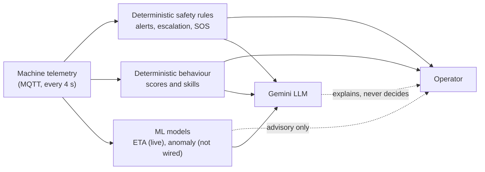
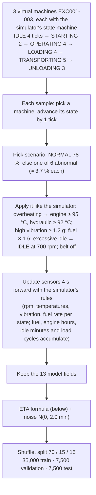
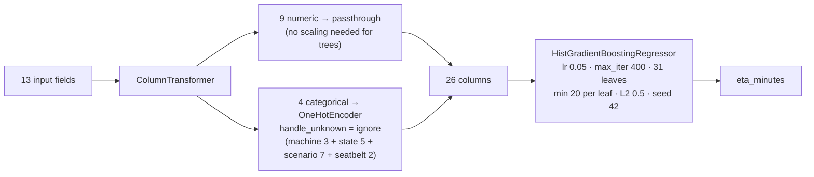
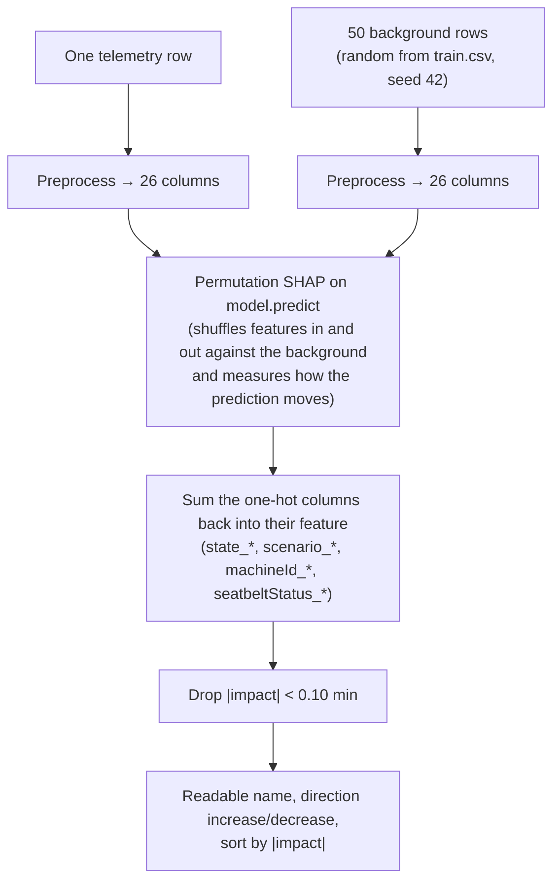
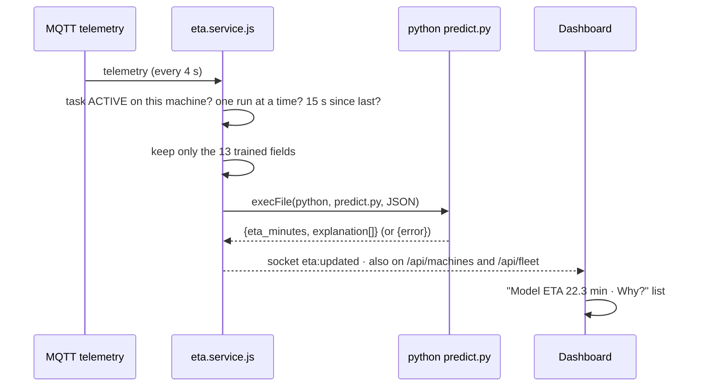
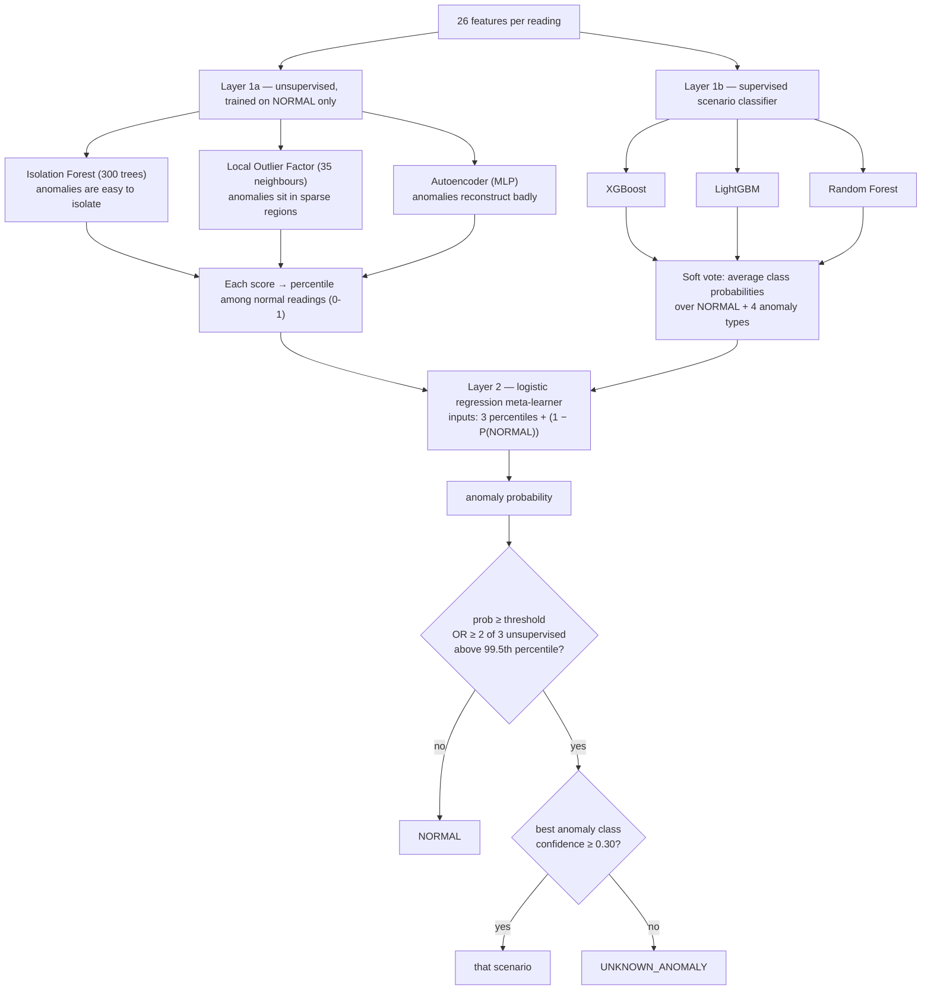
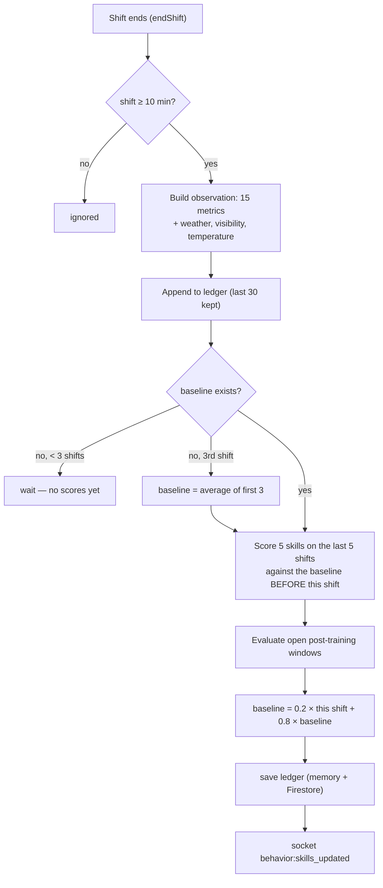
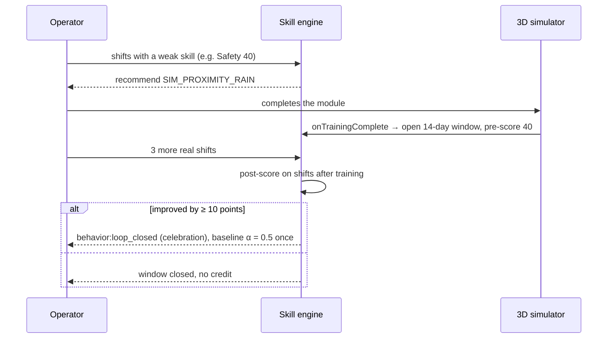
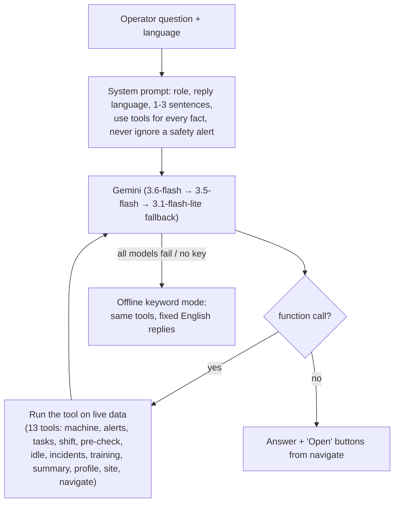

# AI, ML and Decision Engines — how every model works

Written for: the team and the judges who need to understand what each model does, how it was trained, what it
calculates, why those rules were chosen, and how far to trust it.

Everything here was checked against the code and by running it on 24 Sep 2026. Items marked **Verified** were
run, not just read. Diagrams are Mermaid (they render on GitHub and in VS Code's Markdown preview with the Mermaid
extension).

---

## 0. At a glance

| # | Component | Type | Status | Decides safety? |
|---|---|---|---|---|
| 1 | [Safety engine](#5-safety-engine-deterministic) | Deterministic rules | **Live** | **Yes — the only thing that does** |
| 2 | [Live shift safety score](#6-live-shift-safety-score) | Deterministic formula | **Live** | No (records behaviour) |
| 3 | [Operator skill engine](#7-operator-skill-engine-behaviour--personalised-learning) | Deterministic statistics (EMA baselines) | **Live** (fixed 2 bugs, §7.7) | No |
| 4 | [Training recommendations](#8-training-recommendations) | Deterministic rules | **Live** | No |
| 5 | [ETA model](#3-eta-model-histgradientboosting--shap) | ML — gradient-boosted regression + SHAP | **Live** for active tasks | No |
| 6 | [Anomaly ensemble](#4-anomaly-ensemble-stacked-ml--not-connected) | ML — 6-model stacked ensemble | **Live** (trained 24 Sep, advisory — §4.5) | No |
| 7 | [Gemini assistant](#9-gemini-assistant-llm) | LLM with function calling | **Live** | No (read-only) |
| 8 | [Live-pace task ETA](#10-two-etas-on-the-screen) | Arithmetic | **Live** | No |

### The design principle: rules first, ML advises, AI explains



**Why:** a missed alert can hurt someone, so every safety decision comes from fixed, explainable rules that behave
the same every time and can be audited line by line. ML is used where a wrong answer is only inconvenient (an ETA),
and the LLM only reads data through tools and explains it.

---

## 1. What telemetry the machine sends

One MQTT message per machine every 4 s (`machines/{id}/telemetry`), 30 fields:

```json
{"machineId":"EXC001","timestamp":"…","state":"IDLE","scenario":"ABNORMAL_FUEL_CONSUMPTION",
 "engineHours":1397.05,"fuelLevelLitres":319.99,"fuelConsumedLitres":1280.01,"fuelConsumptionRateLph":6.4,
 "loadCycles":10,"idleTime":0.13,"engineRpm":300,"engineTemperature":70,"hydraulicTemperature":65,"vibration":0.15,
 "seatbeltStatus":true,"operatorId":null,"operatorPresent":true,"hydraulicLockout":true,"parkingBrake":true,
 "nearestObjectDistanceM":23.4,"impactG":0.23,"speedKph":0,"tiltAngleDeg":1.7,"swingAngleDeg":0,"boomHeightM":1,
 "loadWeightKg":0,"ratedCapacityKg":5000,"oilPressureKpa":184,"terrain":"FLAT","location":{"latitude":12.97,"longitude":79.156}}
```

States the simulator sends: `IDLE, STARTING, OPERATING, LOADING, TRANSPORTING, UNLOADING`.
`scenario` is the simulator's **label** of what it is simulating; no real machine would send it (see §2).

---

## 2. Feature contract check — do the models get what they were trained on?

| Model | Trained on | What the backend sends now | Verdict |
|---|---|---|---|
| ETA | 13 fields: `machineId, state, scenario, engineHours, fuelLevelLitres, fuelConsumptionRateLph, loadCycles, idleTime, engineRpm, engineTemperature, hydraulicTemperature, vibration, seatbeltStatus` | **Exactly these 13** (changed today in [eta.service.js](backend/src/services/eta.service.js) `toEtaPayload`). A missing field is reported as an error instead of being sent. | ✅ Names and types match |
| Anomaly ensemble | Reads by name: `machineId, timestamp, state, idleTime` + 5 sensors `engineRpm, fuelConsumptionRateLph, engineTemperature, hydraulicTemperature, vibration`. Ignores `engineHours, fuelLevelLitres, fuelConsumedLitres, loadCycles` on purpose. Dataset-only columns `idleRatio, loadCyclesPerHour, fuelPerLoadCycle, isAnomaly` are **not** model inputs. | Nothing — the model is not called | ⚠️ Would accept the live payload (extra fields are ignored), but it is not wired and not trained |

**Extra fields do not break either model** — **Verified:** the ETA pipeline has `remainder="drop"`, and predicting
with the full 30-field payload and with only the 13 fields gave the identical result (34.2804 min). Sending only
the 13 is still safer and is what now happens.

**Value problems the models can't handle (not fixed — "don't improve the model"):**

| Problem | Effect | Verified |
|---|---|---|
| ~~ETA trained on `RUNNING` / `STOPPING`~~ **Fixed 24 Sep 11:52:** the ETA data was regenerated by replaying the simulator's own state machine, so the model now knows `OPERATING, TRANSPORTING, UNLOADING` (a state change moves the prediction). The ETA README (written before that) still describes the old data. | — | ✅ |
| ETA knows 7 scenarios; the simulator has 14 (e.g. `WORKER_NEARBY`, `ROLLOVER_RISK`) and the manual hazards. | Unknown scenarios are ignored (treated as "no scenario"). | ✅ |
| `scenario` is an ETA input. | The model partly predicts from the simulator's answer key; a real machine has no such field. | — |
| `loadCycles` (trained 5–785) and `idleTime` (0.07–470 min) are **cumulative counters** and are the model's two strongest inputs (§3.3). | Fine for a session on a fresh simulator; a machine that has run far past those ranges is predicted as if at the edge. | ✅ |
| Manual hazards can push a sensor past the training range (engine 93 °C, hydraulic 90 °C, vibration 1.12 g were the maxima; the hazard panel goes to 130 °C / 3 g). | The prediction stops reacting beyond the edge of the range. | — |

---

## 3. ETA model (HistGradientBoosting + SHAP)

Folder: [backend/src/ml/eta/](backend/src/ml/eta/) — full detail in its [README](backend/src/ml/eta/README.md).

### 3.1 What it predicts

"Estimated minutes to complete the machine's current operational cycle" (target `eta_minutes`, 3–90 min).
It is shown on the dashboard as **Model ETA** inside the active task panel, with a **Why?** breakdown.

### 3.2 How the training data was made

The data is **synthetic**: [generate_dataset.js](backend/src/ml/eta/data/generate_dataset.js) (seed 42) replays the
**simulator's own state machine and sensor targets** for three machines, samples 50,000 telemetry snapshots, and
computes the ETA with a hand-written formula plus noise.



Because the counters accumulate across the run, `loadCycles` spans 5–785, `idleTime` 0.07–470 min and `fuelLevelLitres`
58–320 in the data. The sensor values are exactly the simulator's (engine 70–93 °C, vibration 0.15–1.12 g, rpm 300–1850).

The formula (minutes):

```
eta = 12
    + stateEffect            IDLE 10, STARTING 7, UNLOADING 5, OPERATING 4, TRANSPORTING 3, LOADING 0
    + 0.025 × loadCycles
    + 0.002 × max(0, engineRpm − 1200)
    + 0.20  × fuelConsumptionRateLph
    + 0.05  × idleTime
    + 0.001 × max(0, engineHours − 1000)
    + 0.04  × (100 − fuelLevelLitres)          if fuel < 100 L
    + 0.25  × (engineTemperature − 90)          if > 90 °C
    + 0.20  × (hydraulicTemperature − 82)       if > 82 °C
    + 5     × (vibration − 0.6)                 if > 0.6 g
    + scenarioEffect         OVERHEATING 7, HIGH_VIBRATION 6, EXCESSIVE_IDLE 5, ABNORMAL_FUEL 5,
                             PROXIMITY_HAZARD 4, SEATBELT_VIOLATION 2, NORMAL 0
    + 1.5                    if the seatbelt is open
    + Normal(0, 2.0);   clamp 3–90
```

**Why these rules:** they encode the intuitions "more work, abnormal conditions and an older or hot machine take
longer". They are plausible, but **invented, not measured** — the model learns this formula, not real machines.

### 3.3 Model and training ([train_model.py](backend/src/ml/eta/train_model.py))



- **Why gradient boosting:** it captures the thresholds and interactions in the formula ("only above 90 °C",
  state × scenario) without hand-made features, and it is fast on tabular data.
- **How boosting works, simply:** it builds up to 400 small decision trees one after another; each new tree
  learns to correct the remaining error of the trees before it, a little at a time (learning rate 0.05).
  With more than 10,000 rows it also holds back 10% internally to stop early when trees stop helping.
- **Results** (from the saved model, retrained 24 Sep 11:52; 207 of the 400 trees were used before early stopping):

  | | MAE | RMSE | R² |
  |---|---|---|---|
  | Validation | 1.63 min | 2.03 min | 0.975 |
  | Test | 1.61 min | 2.01 min | 0.976 |

  The generator adds noise with σ = 2.0 min that nothing can predict, so RMSE 2.01 is **at the noise floor** — the
  model has learned all the signal there is. Always guessing the average gives MAE 11.1 min.
  **A plain linear regression scores almost the same (MAE 1.64, R² 0.975)** because the formula is nearly linear, so
  the ML here proves the pipeline and the explanation, not that boosting is needed. **These numbers show that it
  learned the synthetic formula, not that it is accurate on real machines.**
- **What the model relies on** (permutation importance — how much the error grows when a column is shuffled):
  idle time (+6.1 min), load cycles (+2.8), fuel level (+1.7), scenario (+1.3), fuel rate (+0.5), state (+0.2),
  vibration (+0.2); machine, seatbelt, engine hours, rpm and the temperatures barely matter. The two biggest are
  **cumulative counters**, so the ETA mostly reflects how long the machine has been running rather than the task.

### 3.4 Explanation (SHAP) ([eta_explainer.py](backend/src/ml/eta/eta_explainer.py))



- **What a value means:** "compared with a typical snapshot (the 50 background rows), this factor pushed this
  prediction up/down by N minutes". The values add up to prediction − average prediction.
- **Not causal:** "Engine hours −2.04 min" describes how the *model* used the input, not what would happen if you
  changed it.
- **Why permutation SHAP:** it works on any model through its `predict` function; the tree-specific explainer did
  not work with this model type in the original implementation. The cost is time (≈ 11 s per call measured here,
  because each call also starts Python, loads the model and re-reads the 2.9 MB training CSV) and small
  run-to-run differences (a few hundredths of a minute).
- Requires the `shap` package (installed on this machine today).

### 3.5 How it runs live



Failures (Python missing, model error, timeout 30 s) are logged once and shown as "ETA model unavailable"; the
telemetry pipeline never waits for or depends on it.

---

## 4. Anomaly ensemble (stacked ML) — not connected

File: [backend/src/ml/anomaly_ensemble.py](backend/src/ml/anomaly_ensemble.py) (502 lines, complete code).

**Status (Verified):** nothing imports or calls it
([anomalyDetection.service.js](backend/src/services/anomalyDetection.service.js) is empty); no trained model file
(`models/ensemble.joblib`) exists; `xgboost` is not installed on this machine (`lightgbm` is). Excessive idling and
abnormal fuel consumption are therefore **not detected anywhere** in the live system today.

### 4.1 Training data

`anomaly_detection_dataset.csv` (repo root): 12,600 rows = 3 machines × 4,200 readings (4 s apart, 4 h 40 min).
Each machine has the same four 20-minute anomaly episodes: `OVERHEATING, HIGH_VIBRATION,
ABNORMAL_FUEL_CONSUMPTION, EXCESSIVE_IDLE` (900 rows each), the rest `NORMAL` (9,000).

| Episode | What changes in the data |
|---|---|
| Overheating | engine a flat 93 °C, hydraulic 90 °C (normal ~78 °C while operating) |
| High vibration | a flat 1.12 g (normal ~0.34 g) |
| Abnormal fuel | fuel rate ×1.6 (22.4 vs 14 L/h operating) |
| Excessive idle | 300 readings all IDLE at 550 rpm, idle time climbing |

**Caution (Verified earlier):** the anomalies are flat step changes. A plain Random Forest scored 100% on each
held-out machine, so an accuracy figure from this dataset says little. The dataset's `fuelPerLoadCycle` column is
distorted (up to 182 in normal rows) and `idleRatio` is always 0; the model does not use them.

### 4.2 Features (the same code is used for training and live)

Seasonal "normal" is learned per machine state from NORMAL rows: median and a robust spread
(`max(IQR/1.349, std, 5% of median, 0.001)`). Each reading becomes 26 features:

| Group | Features | Calculation |
|---|---|---|
| State | 6 one-hot flags | current state |
| Raw sensors | 5 | rpm, fuel rate, engine °C, hydraulic °C, vibration |
| Standardised | 5 `z_*` | (value − state median) ÷ state spread |
| Ratios | `fuel_ratio`, `vib_ratio` | value ÷ normal for this state |
| Idle | `idle_rate_per_min`, `idle_streak_s`, `idle_rpm_excess` | growth of idleTime; seconds continuously idle; rpm above normal idle rpm |
| Rolling (last 15 readings = 60 s) | mean z of both temperatures, mean/max vibration ratio, std of vibration, mean fuel ratio | smooths single-reading noise |
| Trend | `engine_temp_trend` | engine °C now − 60 s ago |

Cumulative counters (engine hours, fuel level, fuel consumed, load cycles) are excluded on purpose: they say
*when* in a shift a reading happened, not whether the machine is healthy.

### 4.3 The ensemble



- **Why unsupervised and supervised together:** the classifier names the faults it has seen; the unsupervised
  models flag anything unusual, including faults never seen in training (`UNKNOWN_ANOMALY`).
- **Why stacking with leave-one-machine-out:** the meta-learner is trained on predictions each base model made for
  a machine it had not been trained on, so it learns how much to trust each model on new machines.
- **Threshold:** the meta-learner's cut-off is the middle of the range of thresholds (0.2–0.8) that give the best
  F1 score, so it is not sitting on a knife edge.
- **Honest test:** training holds out one whole machine and reports precision, recall, per-scenario scores and
  detection delay on it.

### 4.4 Live use (designed, not connected)

`StreamDetector.predict_one(reading)` keeps a short history per machine, and reports `confirmed` only when 3 of the
last 5 readings are anomalous (removes one-reading blips). `reasons` lists up to three sensors with |z| ≥ 2
("engineTemperature 93.00 vs normal 78.50 (OPERATING)") plus "idling for N min" after 2 minutes.
A plan to connect it without touching safety decisions is in [../ML_AI_PLAN.md](../ML_AI_PLAN.md).

---

### 4.5 Now trained and live (24 Sep)

- **Trained** with `python anomaly_ensemble.py train --data ../../../../anomaly_detection_dataset.csv --out-dir models`
  (36 s per fit). Held-out machine EXC003: ROC-AUC 1.000, **F1 0.998, precision 0.995, recall 1.000**, every
  fault type caught from its first reading (6 false alarms in 3,000 normal readings). Synthetic step-change data —
  quote as "on held-out synthetic data".
- **Served** by [anomaly_server.py](backend/src/ml/anomaly_server.py) (loads the model once, `StreamDetector`,
  port 8765), started automatically by [anomalyDetection.service.js](backend/src/services/anomalyDetection.service.js),
  which sends each telemetry reading with only the 9 trained fields
  (`machineId, timestamp, state, idleTime` + 5 sensors).
- **Display levels** (service, model unchanged): WARMING until 15 readings; ANOMALY when confirmed (3 of 5) as a
  known fault or probability ≥ 50 %; WATCH when confirmed but weak or unrecognised; otherwise NORMAL.
- **Live test** (simulator scenarios): overheating, high vibration and abnormal fuel detected in **8–12 s** with the
  right label; 0 of 12 normal readings flagged after warm-up.
- **Frontend:** "Machine health (AI)" card under the machine card on the dashboard (state, score, detector votes,
  reasons such as "Engine °C 97.7 vs normal 85.0 while LOADING"); an "AI: …" chip on each machine in the Control
  Room; the assistant's machine status includes it. Transitions are written to the audit log. It never raises or
  silences a safety alert.

## 5. Safety engine (deterministic)

[safety.engine.js](backend/src/services/safety.engine.js) runs on every telemetry message and never reads
`scenario`.

### 5.1 Context-aware stop zone

```
stop zone = 3 m × rain 1.5 × fog/low visibility 1.5 × night (19:00–06:00) 1.3 × loaded 1.2 × speed > 5 km/h 1.3
warning zone = 2 × stop zone
```

Example: rain + night = 3 × 1.5 × 1.3 = **5.9 m** stop zone and 11.7 m warning zone. **Why:** stopping distance
and the chance of not seeing a person both grow in these conditions, so the same distance carries more risk.

### 5.2 Rules

| Rule | Fires when | Severity | Why this rule |
|---|---|---|---|
| Seatbelt | belt open while working, held 5 s | CRITICAL | the main cause of death in rollovers; 5 s avoids alarms for a brief adjustment |
| Proximity | person inside the stop / warning zone | CRITICAL / MEDIUM | struck-by is the most common excavator fatality |
| Rollover | tilt > 15°, or > 10° when loaded with the boom above 2 m | CRITICAL | a raised load moves the centre of gravity |
| Impact | > 2.5 g | CRITICAL | a collision |
| Unattended | nobody in seat, engine running, 30 s | HIGH | machine left live |
| Lockout | nobody in seat, hydraulics unlocked | HIGH | controls can move the arm |
| Overload | load > rated capacity | HIGH | tipping and structural damage |
| Overheating | engine > 105 °C or hydraulic > 95 °C | HIGH | damage and fire risk |
| Low oil pressure | < 150 kPa above 800 rpm | HIGH | engine damage within minutes |
| Vibration | > 0.8 g | MEDIUM | wear and loose parts |
| Fatigue | > 4 h since the task started (resets on pause) | MEDIUM | tiredness raises error rates |

Alerts de-duplicate per machine and rule; CRITICAL ones escalate to the Control Room after 15 s unacknowledged,
create an incident with 60 s of telemetry before and after, and stay on screen until a person acknowledges them.
`npm run evaluate` measures each rule's precision and recall against the simulator's scenario labels.

---

## 6. Live shift safety score

[behaviour.service.js](backend/src/services/behaviour.service.js) — **per shift, live**. (Not to be confused with
the skill engine in §7, which works across shifts.)

```
seatbelt compliance % = time working with belt fastened ÷ time working        (working = OPERATING/LOADING/UNLOADING/TRANSPORTING;
                                                                                 gaps > 10 s between messages ignored)
safety score = 100 − 15·critical − 8·high − 3·medium − 0.3·(100 − seatbelt %)     minimum 0
```

**Why:** alert counts show *events*; compliance shows *how long* a habit lasted — ten minutes without a belt is
worse than ten seconds even though both raise one alert. The weights mirror severity. It updates the dashboard every
5 s and on every new alert, and the end-of-shift summary uses the same numbers.

---

## 7. Operator skill engine (behaviour & personalised learning)

[behaviorEngine.service.js](backend/src/services/behaviorEngine.service.js) +
[behaviorThresholds.js](backend/src/services/behaviorThresholds.js); design doc
[OPERATOR_BEHAVIOR_LEARNING.md](OPERATOR_BEHAVIOR_LEARNING.md). Deterministic — no ML.

### 7.1 Flow



### 7.2 Metrics per shift

| Metric | Calculation |
|---|---|
| idleRatio | shift idle minutes ÷ shift minutes |
| unjustifiedIdleRatio | (shift idle − idle during tasks) ÷ shift minutes |
| fuelPerCycle | fuel on completed tasks ÷ their load cycles |
| idleFuelRatio | (idle minutes ÷ 60 × 4 L/h) ÷ shift fuel |
| rpmVariance | standard deviation of rpm while working (last 150 readings) |
| vibrationRatio | share of working readings above 0.6 g (last 150 readings) |
| impactRate | IMPACT alerts per hour |
| safetyEventsPerHour | this shift's alerts per hour |
| seatbeltViolations, proximityEvents | counts of those alerts |
| taskTimeOverrun | mean(actual ÷ planned minutes) − 1 |
| taskCompletionRate | completed ÷ assigned tasks |
| cycleRateVariance | coefficient of variation of cycles per minute across tasks |

### 7.3 Scoring

For each metric of a skill, averaged over the last 5 shifts:

```
context multiplier = 1.3 if rain × 1.2 if low visibility × 1.2 if ambient > 38 °C
deviation          = max(0, observed − threshold × context multiplier)
penalty            = min(cap, round(deviation ÷ max(baseline, threshold, 0.01) × weight))
skill score        = clamp(100 − Σ penalties (+5 bonus for Idle if idle ratio < 8%), 0, 100)
labels             = ≥ 80 GOOD · ≥ 60 DEVELOPING · ≥ 40 NEEDS_ATTENTION · < 40 CRITICAL
```

| Skill | Metrics (threshold / weight / cap) | Training module |
|---|---|---|
| Idle management | idleRatio 0.15/60/45 · unjustifiedIdleRatio 0.10/40/35 | SIM_SHUTDOWN |
| Fuel efficiency | fuelPerCycleRatio 0.20/50/40 · idleFuelRatio 0.25/30/25 | SIM_SHUTDOWN |
| Smooth operation | rpmVarianceRatio 0.30/35/30 · vibrationRatio 0.15/35/30 · impactRate 0/20/20 | SIM_OVERHEAT |
| Safety awareness | safetyEventsPerHour 0.5/40/35 · seatbeltViolations 0/30/25 · proximityEvents 1/20/20 | SIM_PROXIMITY_RAIN |
| Task execution | taskTimeOverrun 0.20/40/30 · taskCompletionRate (1 − rate)/30/25 · cycleRateVariance 0.25/20/15 | SIM_STARTUP |

`fuelPerCycleRatio` and `rpmVarianceRatio` are **relative to the operator's own baseline**
(observed ÷ baseline − 1; 0.20 = "20% worse than you usually are"). A threshold of 0 means "any occurrence is
penalised".

**Why EMA baselines:** each operator is compared with their own history, so a slow but careful operator is not
punished for a fleet average they never matched. α = 0.2 means about 8–10 shifts are needed to shift the baseline
permanently, so one bad day doesn't redefine "normal"; α = 0.5 is used once after training proves an improvement.

### 7.4 Recommendations

| Trigger | Condition | Urgency |
|---|---|---|
| SKILL_SCORE_LOW | skill < 55 | HIGH if < 40, else MEDIUM |
| SKILL_DECLINING | trend DOWN and scores falling for 3 consecutive shifts | MEDIUM |
| SAFETY_REPEAT | same safety rule in ≥ 3 of the last 5 shifts | HIGH |

A module passed in the last 14 days is not recommended again.

### 7.5 Closed loop



### 7.6 Verification results

In-memory test harness (Firestore off, no real data touched), calling the engine's own functions:

| Check | Result |
|---|---|
| Baseline created after the 3rd shift, scores from then on | ✅ |
| Idle, safety, task and impact penalties | ✅ e.g. Safety 40 after seatbelt + 2 proximity + impact alerts |
| Recommendation for a low skill | ✅ SIM_PROXIMITY_RAIN, SKILL_SCORE_LOW |
| Closed loop after training + 3 shifts | ✅ pre 40 → post 100, improved |
| Ledger survives a restart | ✅ `behaviorLedger` is preloaded from Firestore |
| Live backend `/api/behavior/skills` | ✅ serves OP1001 |
| Fuel efficiency and rpm variance | ❌ → fixed (below) |

### 7.7 Problems found

**Fixed today (minimal changes in `behaviorEngine.service.js`):**

1. **Two metrics were never computed.** The thresholds score `fuelPerCycleRatio` and `rpmVarianceRatio`, but the
   engine only produced `fuelPerCycle` and `rpmVariance`, so both always read 0: fuel efficiency could never drop
   (it stayed 100 while fuel per cycle went up 6×). They are now derived as observed ÷ own baseline − 1.
2. **A bad shift was scored against a baseline that already contained it.** The baseline was updated before scoring,
   so bad shifts partly became their own "normal"; a sustained 3× jump in fuel per cycle was flagged for one shift
   only. Now each shift is scored against the baseline from before it and then folded in. **Verified:** the same 3×
   jump is now flagged for about 6 shifts (scores 60–80) and fades after ~8 shifts, as the design intends.

**Not changed — worth knowing:**

| # | Issue | Effect |
|---|---|---|
| 3 | The 5-shift averaging plus the 20% threshold means a +50% change in fuel per cycle is never flagged. | Only large changes register. Tuning choice. |
| 4 | Weather relaxes **every** threshold, including safety ones (rain × 1.3 on safety events per hour). The design doc says rain relaxes idle and cycle time only. | In rain, more safety events are tolerated — the opposite of the safety engine, which gets stricter in rain. |
| 5 | Normalising by `max(baseline, threshold)` means an operator with a consistently bad baseline gets **smaller** penalties for the same behaviour. | Habitually poor operators look better than they are. |
| 6 | `throttleChopRate` reads `throttlePosition`, which the telemetry doesn't have. | Always 0 (it is not scored, but the doc lists it as tracked). |
| 7 | rpm variance and vibration ratio use the machine's last 150 readings (about 10 minutes), not the whole shift. | They describe the end of the shift only. |
| 8 | "10 minutes of active duration" is measured as wall-clock time since the first task started. | Paused time counts. |
| 9 | Doc items not in the code: queue-wait detection (loading with parking brake), subtracting paused task time, visibility relaxing only speed/rpm, heat relaxing only temperature thresholds, header `x-operator-id`. | The doc describes more than is built. |
| 10 | ~~OP1001's skill scores were typed into the seed~~ **Fixed:** OP1001 now has 13 synthetic past shifts plus one simulation attempt ([seedBehavior.js](backend/src/db/seedBehavior.js)) replayed through the engine, so every score, trend, recommendation and the training result is calculated (Idle 44 ↓, Fuel 91 ↓, Smooth 97, Safety 95 ↑, Task 100; proximity training 37 → 89). Other operators need 3 shifts of ≥ 10 min before any skill appears. | Demo with OP1001. |
| 11 | The rule → module table is copied inside the engine instead of shared with `training.service.js`. | Two places to keep in sync. |
| 12 | ~~A module could be recommended twice (idle and fuel both → SIM_SHUTDOWN)~~ **Fixed:** one recommendation per module, the most urgent reason kept. | — |
| 13 | ~~The Skills, Profile and E-Learning pages ignored `behavior:skills_updated`~~ **Fixed:** they re-fetch when this operator is re-scored. | — |

---

## 8. Training recommendations

[training.service.js](backend/src/services/training.service.js) merges two sources, most personal first:

1. Skill-engine recommendations (§7.4).
2. Alert-based: this week's alerts mapped to modules (`SEATBELT_VIOLATION → SIM_STARTUP`,
   `LOCKOUT_NOT_ENGAGED / UNATTENDED_MACHINE → SIM_SHUTDOWN`, `PROXIMITY_* → SIM_PROXIMITY_RAIN`,
   `OVERHEATING / LOW_OIL_PRESSURE → SIM_OVERHEAT`), most frequent first, skipping modules passed this week;
   then modules never passed.

Simulator scoring: pass = no FAIL ending and ≥ 70% of the maximum score; XP = module XP × score ratio, awarded only
for beating your previous best (no XP farming). The idle-lesson prompt offers the top idle/shutdown recommendation
only when the machine is parked (idle, parking brake, hydraulics locked) for more than 3 minutes.

---

## 9. Gemini assistant (LLM)

[assistant.service.js](backend/src/services/assistant.service.js)



- **Why function calling:** the model never guesses a number; every fact comes from a tool reading the same data
  the dashboard shows. The model only chooses which tools to call and phrases the answer.
- **Guardrails:** read-only (it cannot change shift or alert state), up to 5 tool rounds, last 8 turns of history,
  1000-character messages, refuses to advise ignoring alerts, points to SOS in emergencies.
- **Known inconsistency:** the "normal ranges" it quotes (engine 70–95 °C) do not match the alert limit (105 °C).

---

## 10. Two ETAs on the screen

| | Live pace ("26 min left") | Model ETA ("22.3 min") |
|---|---|---|
| Source | [task.service.js](backend/src/services/task.service.js) | Python ETA model |
| Calculation | remaining cycles ÷ cycles per active minute; the plan until 0.5 min and 1 cycle are done | §3 |
| Knows task progress | **Yes** | **No** — it predicts from the machine's current condition, so it can say 22 min when the task target is already reached |
| Best used for | "when will this task be done" | "how are the conditions affecting work", with the Why? factors |

---

## 11. Summary of limits

- Both ML models are trained on **synthetic** data; their accuracy numbers describe how well they learned the
  generator, not real machines.
- The ETA model sees states and scenarios it was never trained on (§2); predictions for OPERATING / TRANSPORTING /
  UNLOADING ignore the state.
- The anomaly ensemble is complete code but not trained, installed or connected, so idle and fuel anomalies are not
  detected live.
- All safety decisions come from the deterministic safety engine; no model can raise, suppress or change a safety
  alert.
