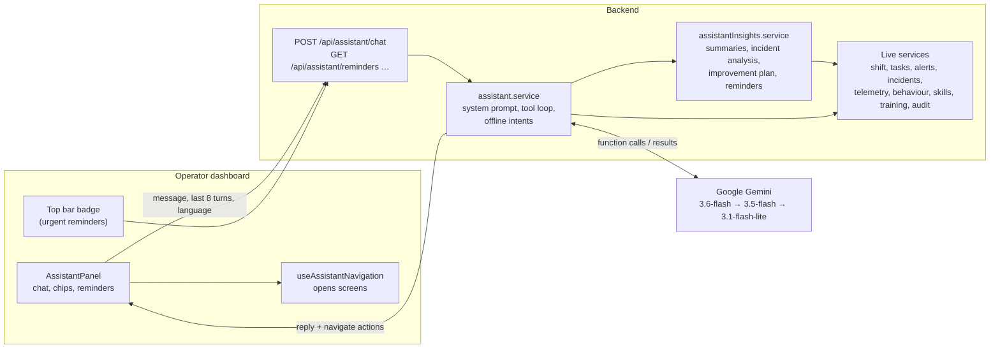
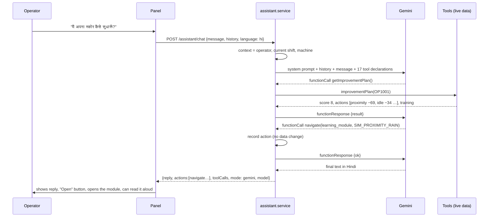
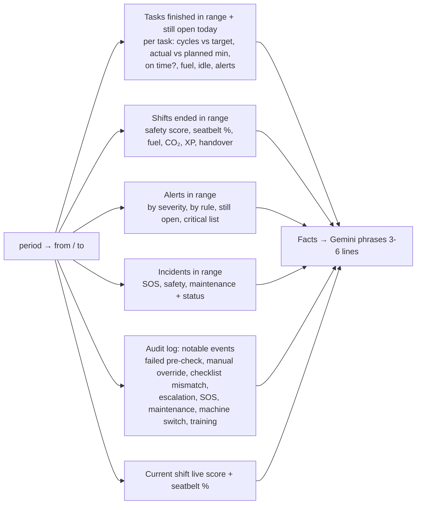
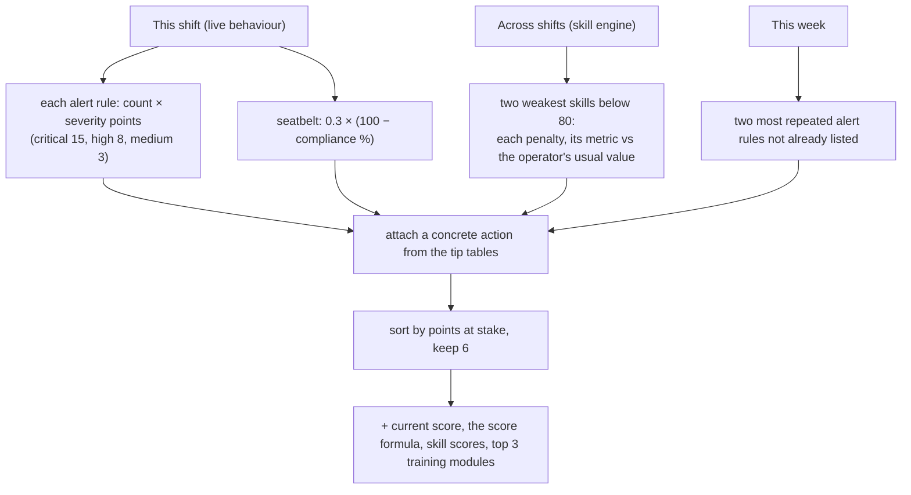

# In-cab AI Assistant — how it works

Written for: the team and anyone presenting or extending the assistant in the operator portal.

The assistant is the **Assistant** button in the operator dashboard's top bar. It answers questions about the
operator's own machine, shift, tasks, safety and training in **English, हिन्दी or தமிழ்**, opens the right screen for
them, summarises their work and incidents, coaches them on improving their score, and reminds them of what needs
attention. It uses **Google Gemini** with function calling. Every fact comes from the live backend, so the model
never invents numbers. When Gemini is unavailable, a built-in offline mode still answers.

Code:
- [assistant.service.js](backend/src/services/assistant.service.js): Gemini loop, tools, system prompt, offline mode.
- [assistantInsights.service.js](backend/src/services/assistantInsights.service.js): summaries, incident analysis, improvement plan, reminders.
- [assistant.routes.js](backend/src/routes/assistant.routes.js): API.
- [AssistantPanel.jsx](frontend/src/assistant/AssistantPanel.jsx): the panel.
- [useAssistantNavigation.js](frontend/src/assistant/useAssistantNavigation.js): opens screens.

---

## 1. What it can do

| Ability | Ask for example | What happens |
|---|---|---|
| **Next step** | "What do I do next?" · "अब मुझे क्या करना है?" | Reads the shift state and reminders, tells the next step, opens that section |
| **Machine status** | "Is my machine healthy?" | Live temperatures, fuel, seatbelt, proximity, tilt, load, oil pressure |
| **Alerts** | "Any alerts?" | Open alerts with severity and reason; opens the alert centre |
| **Work summary** ✨ | "Summarise today's tasks" · "How did my shift go?" · "What did I do this week?" · "आज के काम का सारांश" | Tasks done vs plan, cycles, fuel, idle, alerts by rule, shift scores, incidents, notable log events |
| **Incident summary** ✨ | "What happened in my last incident?" · "What happened in INC-MUF3NW8U?" · "क्या हुआ?" | Cause, timeline (raised → acknowledged by whom → resolved), black-box facts, what to do next time |
| **Improvement coaching** ✨ | "How can I improve my score?" · "Why is my score low?" · "मैं अपना स्कोर कैसे सुधारूँ?" | Where points were lost, 2–3 actions with the most points at stake, recommended training (opens it) |
| **Reminders** ✨ | "Any reminders?" · "What did I miss?" · "मुझे क्या याद रखना चाहिए?" | Prioritised list of what needs attention now (also shown automatically, §6) |
| Pre-check | "Did the pre-check pass?" | Mode, who verified, each sensor |
| Idle and fuel | "How much fuel did I waste idling?" | Idle minutes this shift, litres and ₹ |
| Training | "Which training should I do?" · "Take me to seatbelt training" | Recommended modules with reasons; opens the 3D simulation |
| Site | "Is it safe to work in this rain?" | Weather, visibility, current stop distance and why |
| Profile | "What level am I?" | XP, level, badges |
| Navigation | "Open task history" | Opens any screen: dashboard sections, e-learning, a module, history, profile, control room |
| Emergency | "Help, accident!" | Tells them to hold SOS for 2 s and opens it |

✨ = added in this version.

---

## 2. Architecture

**The key design choice:** the model does not know anything about the site. It only chooses **which tools to
call** and **how to phrase** the answer. The tools read the same live data the dashboard shows. This is why it
can answer "how many cycles did I do?" correctly, and why it cannot make up a number.

---

## 3. One question, step by step

- **Loop:** up to **5 rounds** of tool calls per question. The model's function-call turn is echoed back
  unchanged, because Gemini needs its "thought signatures" to continue.
- **Model fallback:** the models in `GEMINI_MODELS` are tried in order. A model that errors (quota, overload,
  timeout 25 s) is skipped for the rest of that question.
- **If every model fails, or there is no API key:** the offline mode answers (§8).
- **History:** the panel sends the last 8 turns, so follow-ups work ("and yesterday?").

---

## 4. The system prompt (rules the model follows)

Built per request in `systemPrompt()`:

1. **Role:** "You are the in-cab assistant for a Caterpillar excavator operator: *name (id)*, working on machine *X*",
   plus the current local time.
2. **Language:** always reply in the operator's language (English / Hindi / Tamil).
3. **Length:** 1–3 short sentences, plain words, numbers with units, no markdown. Summaries, plans and reminders may
   use up to 6 lines starting with "• ".
4. **No guessing:** use the tools for any fact about the machine, alerts, tasks, shift, pre-check, training,
   incidents or site.
5. **Navigation:** open a screen whenever the user wants to see or do something, and always answer in words too.
6. **Training:** match the topic to the module and open it; name modules by title, never by ID.
7. **Flow:** knows the dashboard flow (pre-check → checklist → task → end shift).
8. **Summaries:** call `getWorkSummary`; lead with tasks vs plan, then safety, then anything unusual. If nothing
   happened, say so.
9. **Incidents:** call `getIncidentSummary`; explain the cause from black-box facts, who responded, and what to do
   next time.
10. **Improvement:** call `getImprovementPlan`; give the 2–3 actions with the most points at stake, how many points
    each costs, and offer the training.
11. **Reminders:** call `getReminders`; also check it when asked "what do I do next".
12. **Tone:** coach, don't scold — what went well before what to fix.
13. **Times:** say the `…Local` fields; plain ISO timestamps are UTC.
14. **Routing by meaning in any language:** e.g. सुधार / மேம்படுத்த → improvement plan, सारांश / சுருக்கம் → summary.
15. **Limits:** if no tool covers it, say you don't have that information. Never tell the operator to ignore a safety
    alert. In an emergency, tell them to hold SOS for 2 seconds.

---

## 5. The tools (17)

All tools are **read-only**; `navigate` only records a screen to open.

| Tool | Returns | Source |
|---|---|---|
| `getMachineStatus` | connectivity, state, temperatures, fuel %, seatbelt, operator present, lockout, nearest object, tilt, load, oil | latest telemetry |
| `getActiveAlerts` | open alerts: rule, severity, status, reason | alert service |
| `getTodayTasks` | today's tasks, targets, planned range, live progress, results | task service |
| `getShiftState` | state, checklist items (done / todo / rejected), pre-check needs ack | shift service |
| `getPrecheckResult` | mode, verified by, overall, each sensor, ticket, spare machines | shift.precheck |
| `getIdleStats` | idle minutes this shift, idle fuel L and ₹ (4 L/h idle burn) | telemetry vs shift start |
| `getIncidents` | incidents list, **this operator by default** (`allOperators` for the site) | incident service |
| `getTrainingModules` | modules, what they teach, the operator's progress | training service |
| `getTrainingRecommendations` | recommended modules and why | skill engine + alerts |
| `getShiftSummary` | last finished shift's summary | shift.summary |
| `getOperatorProfile` | name, XP, level, badges | operator service |
| `getSiteConditions` | weather, visibility, temperature, safety envelope | site service |
| `getWorkSummary` ✨ | §7.1 | tasks, shifts, alerts, incidents, audit log, live behaviour |
| `getIncidentSummary` ✨ | §7.2 | incident + its alert + black box |
| `getImprovementPlan` ✨ | §7.3 | live behaviour, skill engine, week's alerts, training |
| `getReminders` ✨ | §6 | everything above |
| `navigate` | `{target, moduleId}` → an action for the panel | — |

Navigation targets: `dashboard, machine, precheck, checklist, tasks, alerts, sos, learning, learning_module,
history, profile, control_room`. The panel turns them into a route and scrolls to the section (`?focus=`); `alerts`
opens the alert centre and a module opens the 3D simulator.

---

## 6. Reminders (proactive help)

Reminders are calculated by rules, not by the model, so they are instant, free and always consistent. They appear:
- at the top of the panel when it opens (tap one to go to that screen);
- as a **count badge** on the Assistant button for HIGH and MEDIUM items (red if any HIGH);
- in answers to "any reminders?" and "what do I do next?".

The dashboard refreshes them every 20 s, and within a second of any change to the shift state, checklist, warnings,
alerts, tasks or SOS.

```mermaid
flowchart TD
    S["reminders(operatorId)"] --> A["Safety first"]
    A --> A1["Unacknowledged alerts (HIGH if critical)"]
    A --> A2["Own SOS still open (HIGH)"]
    A --> A3["Seatbelt open while working (HIGH)"]
    S --> B["Next step in the shift"]
    B --> B1["Not started → run pre-check"]
    B --> B2["Pre-check failed → ticket + spare machine (HIGH)"]
    B --> B3["Warnings not acknowledged (HIGH)"]
    B --> B4["Checklist items left"]
    B --> B5["Task paused → resume · target reached → complete<br/>behind plan → by N min"]
    B --> B6["Ready → start next task · all done → end shift with handover"]
    S --> C["Wellbeing and machine"]
    C --> C1["≥ 2 h without a break (before the 4 h fatigue alert)"]
    C --> C2["Idling ≥ 5 min with engine on"]
    C --> C3["Fuel < 15 %"]
    C --> C4["Rain / fog / low visibility → current stop distance"]
    C --> C5["Open maintenance ticket on this machine"]
    S --> D["Learning — only when parked and not mid-task"]
    D --> D1["Top recommended training"]
    A1 & A2 & A3 & B1 & B2 & B3 & B4 & B5 & B6 & C1 & C2 & C3 & C4 & C5 & D1 --> R["Sort HIGH → MEDIUM → LOW"]
```

| Code | When | Priority | Opens |
|---|---|---|---|
| `ALERT_UNACKED` | alert ALERTED / ESCALATED on this machine | HIGH if critical, else MEDIUM | alert centre |
| `SOS_OPEN` | operator's SOS open or acknowledged | HIGH | SOS |
| `SEATBELT_OPEN` | working state and belt open | HIGH | machine |
| `RUN_PRECHECK` | shift NOT_STARTED | MEDIUM | pre-check |
| `PRECHECK_FAILED` | pre-check FAIL | HIGH | pre-check |
| `ACK_WARNINGS` | PASS_WITH_WARNINGS not acknowledged | HIGH | pre-check |
| `CHECKLIST_LEFT` | checklist items unticked | MEDIUM | checklist |
| `RESUME_TASK` | task paused | MEDIUM | tasks |
| `TARGET_REACHED` | cycles ≥ target | MEDIUM | tasks |
| `TASK_BEHIND` | projected time > plan high | MEDIUM | tasks |
| `START_TASK` | ready and a task pending | MEDIUM | tasks |
| `END_SHIFT` | ready and no task left | LOW | dashboard |
| `BREAK_DUE` | ≥ 120 min continuous work | MEDIUM | dashboard |
| `IDLE_LONG` | IDLE with engine running ≥ 5 min | LOW | machine |
| `LOW_FUEL` | fuel < 15 % | MEDIUM | machine |
| `WEATHER` | not CLEAR or visibility LOW | LOW | machine |
| `MAINTENANCE_OPEN` | open maintenance ticket | LOW | pre-check |
| `TRAINING` | a recommendation exists, machine parked, no active task | LOW | the module |

Thresholds are at the top of `assistantInsights.service.js` (`BREAK_AFTER_MIN`, `IDLE_REMINDER_MIN`, `LOW_FUEL_PCT`).
Each reminder is sent as a **code + parameters** and translated on the device (`reminder.*` keys in `i18n/`).

---

## 7. The new analyses

### 7.1 Work summary — `getWorkSummary(period)`

`period`: `today` (from local midnight), `yesterday`, `week` (last 7 days) or `shift` (since the current shift
started).

Totals: tasks completed / incomplete / still open, total cycles, fuel, idle minutes, and **on time** (actual ≤ the
plan's upper bound). Every time comes with a local-time field.

Real example (OP1001, today): *"• Completed 2 tasks on time: trench in 6 minutes and access road in 17 minutes.
• Loading haul trucks is paused with 1 cycle completed. • Safety score 8 with 99.2% seatbelt compliance. • 45 alerts
today, mostly proximity warnings. • 1 open critical incident for a seatbelt violation."*

### 7.2 Incident summary — `getIncidentSummary(incidentId?)`

Without an ID it uses the operator's latest incident. It combines the incident, the alert that created it and the
black box:

| Output | How it is calculated |
|---|---|
| Timeline | the alert's history (DETECTED → ALERTED → ESCALATED → ACKNOWLEDGED by *who* → RESOLVED) merged with the incident's own history (ACKNOWLEDGED / RESOLVED / CANCELLED by *who*), sorted by time |
| At the event | the last telemetry reading before the event: state, seatbelt, operator present, nearest object, speed, engine °C, tilt, load, and how many seconds before the event it was taken |
| Across the window | closest object, maximum engine °C, tilt, impact g and speed, and seconds with the belt open (readings × 4 s) over the 60 s before and after |
| What to do next time | the safety tip for that rule (table in §7.3) |
| Maintenance tickets | the failed sensors |

Real example: *"At 11:07 on 24 Sept, a critical alert was raised because your seatbelt was unfastened for 72 seconds
while operating. You acknowledged the alert, and the system resolved it once the condition cleared. Next time, fasten
your seatbelt before starting the engine and keep it on until the hydraulics are locked."*

### 7.3 Improvement plan — `getImprovementPlan()`

**Points at stake** is the number of score points that item is costing, so the operator knows what matters most.
Tips are fixed, reviewed text; the model only rephrases and translates them.

| Rule | Action |
|---|---|
| Seatbelt | Fasten before starting; keep on until hydraulics are locked |
| Proximity critical | Stop, sound the horn, wait for eye contact |
| Proximity warning | Watch mirrors and camera, slow down near people; zone is 1.5× larger in rain or fog |
| Unattended / lockout | Lower the bucket, lock the hydraulics, switch off before leaving the seat |
| Rollover | Bucket low when moving; avoid working across slopes |
| Overload | Smaller loads, stay under rated capacity |
| Overheating | Idle down to cool; check coolant and radiator in the walk-around |
| Low oil | Stop and report; check oil in the walk-around |
| Vibration | Smooth joystick movements; report persistent vibration |
| Impact | Slow down near obstacles; check the camera before swinging |
| Fatigue | 10-minute break every 2 hours |

Skill metrics have their own tips, e.g. idle → "switch off if waiting more than 5 minutes", fuel per cycle →
"lower throttle for light digging", task overrun → "position trucks before starting".

Real example (Hindi): *"अर्जुन, आपका स्कोर सुधारने के लिए यहाँ कुछ सुझाव हैं: • मशीन के पास लोगों को देखते ही गति धीमी करें… • 5 मिनट से
ज्यादा इंतज़ार होने पर इंजन बंद कर दें… क्या आप अभी इनमें से कोई ट्रेनिंग शुरू करना चाहेंगे?"* ("Arjun, here are some tips to improve your score: • slow down as soon as you see people near the machine… • switch the engine off if you'll wait more than 5 minutes… Would you like to start one of these trainings now?")

---

## 8. Offline mode

Used when there is no `GEMINI_API_KEY`, or every Gemini model fails (quota, network). Keyword patterns in English,
Hindi and Tamil pick an intent. The intent calls the **same tools** and formats a fixed English reply; navigation
still works. The first matching intent wins, in this order:

1. summary (summar, recap, today's work, सारांश, சுருக்க, …) → `getWorkSummary` (week / yesterday detected)
2. improve (improve, my score, सुधार, மேம்படுத்த, …) → `getImprovementPlan` + open training
3. reminders (remind, missed, याद, நினைவூட்ட, …) → `getReminders`
4. incident (what happened, incident, क्या हुआ, என்ன நடந்த, or an ID like `INC-…`) → `getIncidentSummary`
5. SOS · pre-check · checklist · alerts · tasks · fuel/idle · training · history · profile · weather · machine

Verified: a Tamil "today's summary" question was answered by the offline mode when all Gemini models failed.
The reply shows an "Offline mode" tag.

---

## 9. Languages and voice

- Replies come in the operator's selected language; the panel sends `language` with every message.
- Reminders, chips and panel text are translated on the device (`i18n/en.js`, `hi.js`, `ta.js`).
- Every reply has a **read aloud** button (Web Speech: `en-IN`, `hi-IN`, `ta-IN`).
- Offline replies are English only.

---

## 10. Safety and guardrails

| Guardrail | How |
|---|---|
| Cannot change anything | every tool is read-only; the assistant cannot acknowledge alerts, change the shift, start tasks or cancel SOS |
| Cannot invent facts | prompt rule + all facts come from tools; missing data → "I don't have that information" |
| Never overrides safety | alerts come only from the safety rules engine; the prompt forbids advising to ignore an alert |
| Emergencies | always points to the SOS button |
| Scoped to the operator | tools default to the operator's own shift, machine, tasks and incidents |
| Bounded | message ≤ 1000 characters, 8 turns of history, 5 tool rounds, 25 s per model call |
| Key handling | `GEMINI_API_KEY` only in `backend/.env` (gitignored); never sent to the browser |

---

## 11. API

| Method | Path | Returns |
|---|---|---|
| POST | `/api/assistant/chat` `{message, history, language}` | `{reply, actions, toolCalls, mode, model}` |
| GET | `/api/assistant/reminders` | reminders with `code`, `params`, `priority`, English `text` and a ready `action` |
| GET | `/api/assistant/summary?period=today\|yesterday\|week\|shift` | §7.1 facts |
| GET | `/api/assistant/improvement` | §7.3 facts |
| GET | `/api/assistant/incident/:incidentId?` | §7.2 facts |

All take `operatorId` (the dashboard adds it from `?operator=`).

---

## 12. Tested today (24 Sep)

| Question | Language | Tools called | Result |
|---|---|---|---|
| Give me a summary of today's tasks | en | getTodayTasks, getWorkSummary | ✅ 5-line summary |
| How can I improve my safety score? | en | getImprovementPlan, navigate | ✅ 3 actions with points, opened the proximity training |
| Any reminders for me? | en | getReminders | ✅ resume task, 83 min behind |
| What happened in my last incident? | en | getIncidentSummary | ✅ cause, time 11:07 local, response, advice |
| मेरा स्कोर कैसे सुधारूँ? ("How do I improve my score?") | hi | getImprovementPlan | ✅ Hindi coaching |
| मुझे क्या याद रखना चाहिए? ("What should I remember?") | hi | getReminders | ✅ Hindi reminders |
| இன்றைய வேலையின் சுருக்கம் ("Today's work summary") | ta | — (Gemini unavailable) | ✅ offline summary (English) |
| Panel in the browser | en / hi | — | ✅ badge "2", reminders list, translated chips and reminders, no page errors |

## 13. Limits

- **Latency:** Gemini answers take roughly 3–10 s depending on the model and how many tools it calls.
- **Quota:** heavy use can trigger quota or rate limits. The assistant then drops to the lite model or the offline
  mode.
- **Event log:** the audit log used for "notable events" is held in memory since the last backend restart (up to 500
  events). Tasks, shifts, alerts and incidents come from Firestore and are complete.
- **No voice input yet:** questions are typed or tapped; answers can be read aloud.
- **Normal ranges:** the machine-status tool's "normal ranges" (engine 70–95 °C) differ from the alert limit
  (105 °C).
