# CATman_central Backend — Features, Flows and Connections

Written for: engineers joining the project who need to understand how the backend works.
Everything here is taken from the code in [backend/](backend/) as it is today. Diagrams are
[Mermaid](https://mermaid.js.org/); they render on GitHub and in the VS Code Markdown preview
(with the "Markdown Preview Mermaid Support" extension). The list of hard-coded values is in
[HARDCODED_DATA.md](HARDCODED_DATA.md).

Contents: [1 Overview](#1-overview) · [2 Boot](#2-startup-sequence) · [3 Connections](#3-how-everything-is-connected) ·
[4 Data layer](#4-data-layer) · [5 Telemetry](#5-telemetry-pipeline) · [6 Pre-check](#6-machine-pre-check) ·
[7 Shift](#7-shift-state-machine-and-checklist) · [8 Tasks](#8-tasks-and-live-eta) · [9 Safety](#9-safety-engine) ·
[10 Alerts](#10-alert-lifecycle) · [11 Incidents / SOS](#11-incidents-sos-and-the-black-box) ·
[12 Training](#12-training-xp-and-recommendations) · [13 Assistant](#13-gemini-assistant) ·
[14 Other](#14-smaller-features) · [15 API](#15-rest-api) · [16 Socket](#16-socket-events) ·
[17 ML folder](#17-ml-code-in-the-backend-folder-not-connected) · [18 Observations](#18-things-worth-knowing)

---

## 1. Overview

The backend is one Node process (Express + Socket.IO + MQTT client). It receives live machine data over
MQTT, applies business rules, stores state, and pushes updates to the dashboard. It sends commands back to the
machine (pre-check, horn, shift start/end) over MQTT.

| Concern | Technology | Where |
|---|---|---|
| HTTP API | Express 4, JSON, CORS (any `localhost` port + `CLIENT_URL`) | [server.js](backend/src/server.js), [routes/](backend/src/routes/) |
| Live push to browser | Socket.IO 4, one broadcast channel, no rooms, no auth | [socket/socket.js](backend/src/socket/socket.js) |
| Machine link | MQTT (`mqtt` package) to a broker on `MQTT_URL` | [mqtt.service.js](backend/src/services/mqtt.service.js) |
| Decoupling | In-process event bus (`EventEmitter`) | [bus.js](backend/src/services/bus.js) |
| Storage | In-memory maps + background write to Firestore (Firebase client SDK) | [db/repo.js](backend/src/db/repo.js), [db/firestore.js](backend/src/db/firestore.js) |
| AI assistant | Gemini REST API with function calling, offline keyword fallback | [assistant.service.js](backend/src/services/assistant.service.js) |
| Seed data | JSON files | [data/](backend/src/data/) |

**Layering.** `routes/` are thin: they read `operatorId`, call one service function, and return JSON (the
`handle()` wrapper in [routes/util.js](backend/src/routes/util.js) forwards thrown errors to the error middleware,
using `err.status`). All rules live in `services/`. Services never import a route.

**No login.** The operator is `?operatorId=` / body `operatorId`, defaulting to `OP1001`
([operator.service.js](backend/src/services/operator.service.js)). The frontend adds it from `?operator=`.

---

## 2. Startup sequence

Order matters: storage first, then services that register listeners, then MQTT (so no message arrives before its
listener exists), then the HTTP listener.

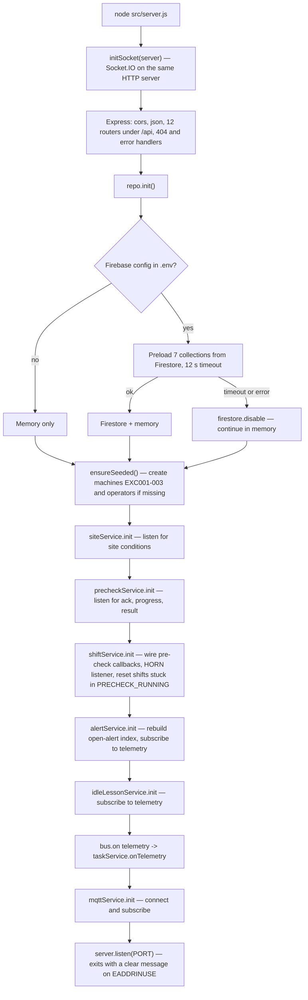

---

## 3. How everything is connected

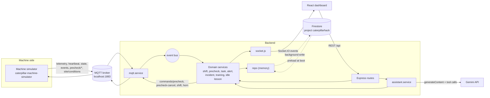

### 3.1 MQTT

The backend connects with `clientId=catman-central-<time>`, `clean: true`, reconnect every 3 s, connect timeout 5 s.
On connect it subscribes (QoS 1) to:

| Topic | Payload from the machine | What the backend does |
|---|---|---|
| `machines/{id}/telemetry` | Full sensor snapshot every ~4 s | store latest + history, mark machine seen, broadcast `machine:telemetry`, emit bus `telemetry` |
| `machines/{id}/heartbeat` | Small liveness message every 5 s | mark machine seen; bus `heartbeat` (no listener yet) |
| `machines/{id}/state` | State changes | bus `machineState` (no listener yet) |
| `machines/{id}/events` | `{type, severity, data}` e.g. `HORN`, `IMPACT` | bus `machineEvent` → horn confirmation in shift service |
| `machines/{id}/precheck/ack` | `{requestId, mode}` | bus `precheckAck` |
| `machines/{id}/precheck/progress` | `{requestId, sensor}` one sensor | bus `precheckProgress` |
| `machines/{id}/precheck/result` | `{requestId, sensors[], verifiedBy}` | bus `precheckResult` |
| `site/conditions` | weather, visibility, ambient °C | bus `site` |

Commands the backend **publishes** (QoS 1) through `publishCommand(machineId, command, payload)`:

| Topic | Sent when |
|---|---|
| `machines/{id}/commands/precheck` | Operator starts a pre-check |
| `machines/{id}/commands/precheck-cancel` | Operator cancels it |
| `machines/{id}/commands/horn` | Operator presses "Test horn" |
| `machines/{id}/commands/shift` | First task starts (`START`) and shift end (`END`) |

If MQTT is disconnected, `publishCommand` throws HTTP **503** ("cannot reach the machine"); the shift-start/end
commands catch it and only log, so a broker outage does not block ending a shift. Invalid JSON is logged and dropped.

### 3.2 Socket.IO

`socket.js` creates one `Server` with the same CORS rule as Express. There are **no rooms and no auth**; every
connected browser receives every event and filters by its own machine/operator. Full list in [§16](#16-socket-events).

### 3.3 REST

Twelve routers mounted under `/api` ([server.js](backend/src/server.js)). Table in [§15](#15-rest-api).
Errors come back as `{ error, code }` with `err.status` as the HTTP status (409 for wrong state, 404 not found, 503 no MQTT).

### 3.4 Firestore

Client SDK, `initializeFirestore(app, { ignoreUndefinedProperties: true })`, web config from `.env`.
Firestore is in **test mode** (no server-side auth check). See [§4](#4-data-layer).

### 3.5 Gemini

`POST https://generativelanguage.googleapis.com/v1beta/models/{model}:generateContent` with header `x-goog-api-key`.
See [§13](#13-gemini-assistant).

---

## 4. Data layer

[repo.js](backend/src/db/repo.js) is a document store with **memory as the source of truth for reads** and Firestore as
durable storage written in the background. The app therefore stays fast and keeps working if Firestore is slow,
offline, or rejects writes.

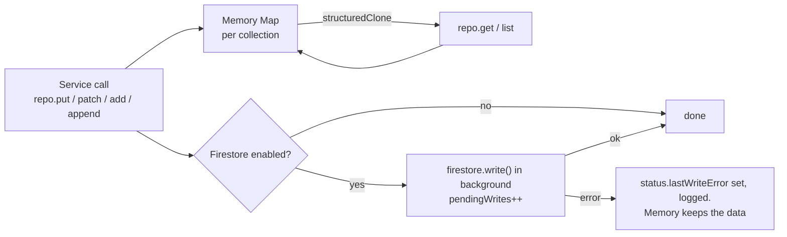

- `get` / `list` return **deep clones**, so services can mutate what they read without changing stored state until
  they call `put`.
- `patch` = merge then `put`. `add` = `put` with a random id when none is given.
- `append` (used only for `auditLog`) keeps at most **500** docs in memory (oldest dropped) but writes every one to Firestore.
- At boot, seven collections are preloaded: `machines, operators, tasks, shifts, alerts, incidents, trainingProgress`.
  `auditLog` is **not** preloaded, so after a restart the in-memory audit view starts empty (Firestore still has it).
- `/api/health` exposes `storage: { firestore, loadedAt, lastWriteError, pendingWrites }`.

| Collection | Written by | Document id | Main contents |
|---|---|---|---|
| `machines` | seed | `EXC001` … | name, type |
| `operators` | seed, `operator.service` | `OP1001` … | name, experience, certifications, assignedMachineId, language, xp |
| `tasks` | `task.service` | `<templateId>-<YYYY-MM-DD>` | status, baseline, activeMs, progress, result |
| `shifts` | `shift.service` | `<operatorId>-<timestamp>` | state, precheck, checklist, history, summary |
| `alerts` | `alert.service` | `ALR-…` | rule, severity, status, history, evidence, params |
| `incidents` | `incident.service` | `INC-…`, `SOS-…`, `MNT-…` | type, status, location, black box |
| `trainingProgress` | `training.service` | `<op>-<module>-<time>` | score, passed, xp |
| `auditLog` | `audit.service` | uuid | type, ids, data, at |

Seeding ([db/seed.js](backend/src/db/seed.js), `npm run seed [-- --force]`) creates missing machines and operators
only; `--force` overwrites them.

---

## 5. Telemetry pipeline

Everything starts with one MQTT telemetry message. One handler fans it out, and each consumer is independent
(a failure in one does not stop the others because they are separate event-bus listeners).

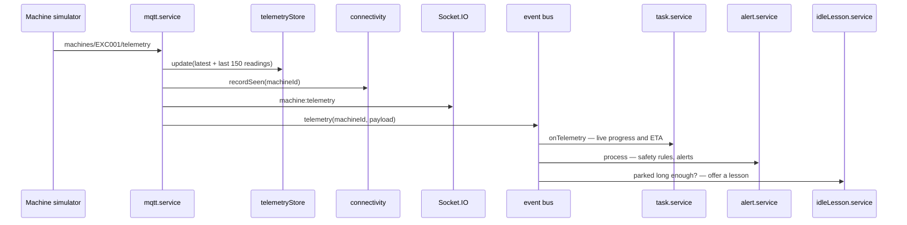

- **Telemetry store** ([telemetryStore.service.js](backend/src/services/telemetryStore.service.js)): latest reading and
  a rolling history of 150 readings per machine (about 10 minutes). Memory only. The black box and live task progress
  read from it.
- **Connectivity** ([connectivity.service.js](backend/src/services/connectivity.service.js)): every telemetry **or**
  heartbeat updates `lastSeenAt`. A 3-second monitor recomputes status for every registered machine:

  | Age of last message | Status |
  |---|---|
  | ≤ `HEARTBEAT_STALE_SEC` (10 s) | `ONLINE` |
  | ≤ `HEARTBEAT_OFFLINE_SEC` (20 s) | `STALE` |
  | older or never | `OFFLINE` |

  A change is pushed as `machine:connectivity`. Machines that never sent anything stay `OFFLINE`.
- **Site conditions** ([site.service.js](backend/src/services/site.service.js)): defaults `CLEAR / GOOD / 31 °C`,
  overwritten by each `site/conditions` message, pushed as `site:conditions`. The safety envelope uses it.
- **Machine view** ([machine.service.js](backend/src/services/machine.service.js)): registry doc + latest telemetry +
  connectivity + `fuelPercent` (fuel litres ÷ 400 L tank), used by `/api/machines`, `/api/fleet`, and the assistant.

---

## 6. Machine pre-check

Purpose: before work starts, ask the machine to check its 15 sensors and only let the shift continue if the
critical ones are healthy. The **machine side** decides how the check is done:

- **AUTO** — the machine grades its own sensors and reports in a few seconds.
- **MANUAL (human in the loop)** — a person on the simulator page marks each sensor; every mark is sent as a
  `progress` message and shows up live on the operator's dashboard; Submit sends the `result`.

The backend does not care which mode: it only relays `progress` to the shift and computes the **final verdict itself**.

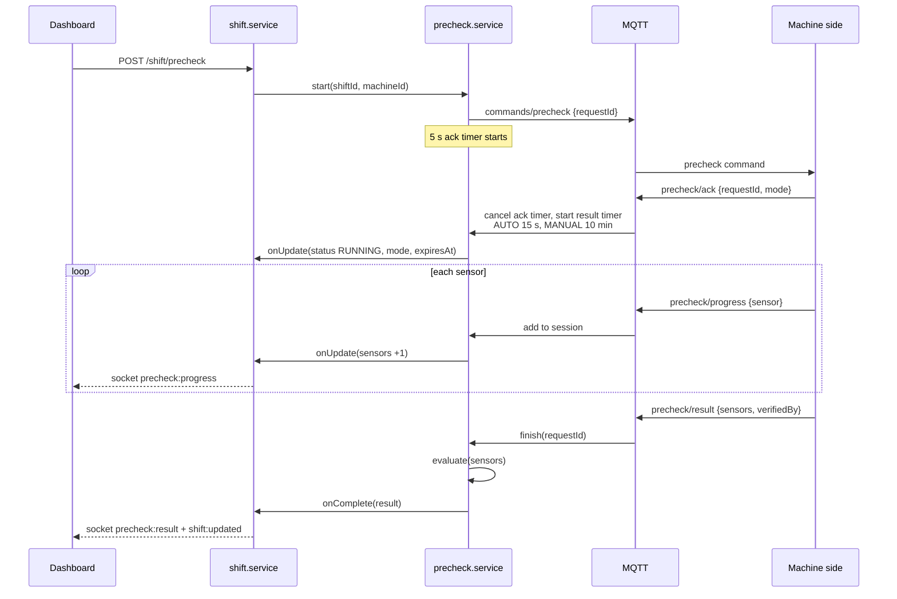

**Verdict rule** (`evaluate` in [precheck.service.js](backend/src/services/precheck.service.js)):

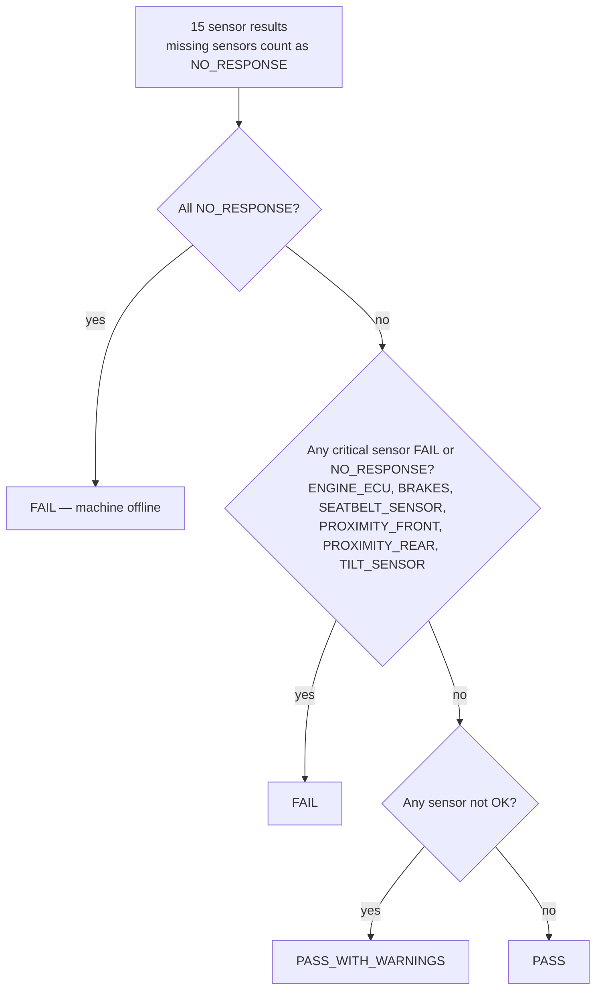

**Failure paths.** No `ack` within 5 s → `TIMEOUT / NO_RESPONSE` with no sensors → verdict FAIL ("machine offline").
No `result` within 15 s (AUTO) or 10 min (MANUAL) → finishes with whatever `progress` arrived; the rest are
`NO_RESPONSE`. Sessions live in memory only, so a backend restart cancels in-flight pre-checks
(`shiftService.init` resets those shifts to `NOT_STARTED`).

**What the shift does with the result** (`onPrecheckComplete`):

| Overall | Shift state | Extra work |
|---|---|---|
| `PASS` | `PRECHECK_PASSED` | none |
| `PASS_WITH_WARNINGS` | `PRECHECK_PASSED` with `needsAck` | operator must acknowledge warnings before the checklist opens |
| `FAIL` | `PRECHECK_FAILED` | list failed sensors; **maintenance ticket** (`MNT-…`, HIGH) unless the machine was entirely silent; **spare machines** list (registered machines not used by another operator's active shift, ONLINE first) |

In MANUAL mode a sensor that a person changed from what the machine read (`override`) writes a
`PRECHECK_MANUAL_OVERRIDE` audit entry with the old and new status and the note.

---

## 7. Shift state machine and checklist

One shift per operator per work session ([shift.service.js](backend/src/services/shift.service.js)). Every
transition appends to `shift.history` and writes an audit entry; each save emits `shift:updated`.
Invalid transitions return HTTP 409 `INVALID_STATE`.

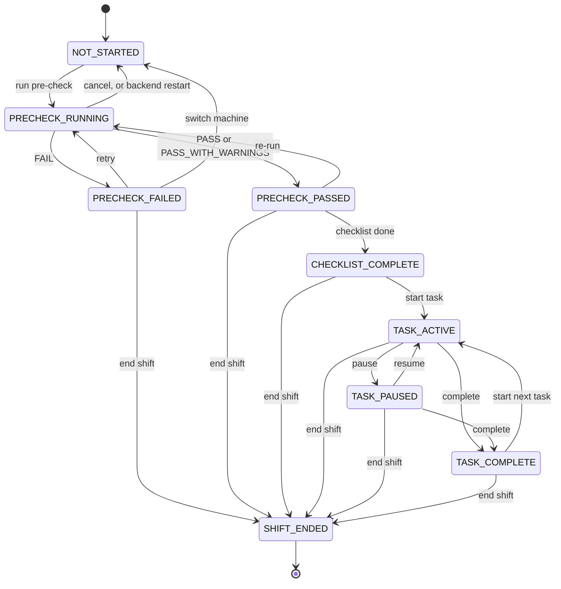

`GET /shift/current` returns the operator's latest shift or creates a new `NOT_STARTED` one. `POST /shift/new`
is allowed only after the shift ended (or is `NOT_STARTED` / `PRECHECK_FAILED`, which are discarded).
`switch-machine` (only in `NOT_STARTED` / `PRECHECK_FAILED`) reassigns the shift to a spare machine.

### 7.1 Safety checklist — verified against the machine, not just ticked

Available only in `PRECHECK_PASSED` (and after warnings are acknowledged). Six items:

| Item | How it is verified |
|---|---|
| `SEATBELT_FASTENED` | **Sensor**: latest telemetry must have `seatbeltStatus === true`, else HTTP 409 `SEATBELT_NOT_DETECTED` and an audit `CHECKLIST_MISMATCH` |
| `WALKAROUND_DONE`, `MIRRORS_ADJUSTED`, `PPE_WORN`, `AREA_CLEAR` | Operator confirmation only |
| `HORN_TESTED` | **Machine event**: cannot be ticked directly (HTTP 400 `USE_HORN_TEST`) |

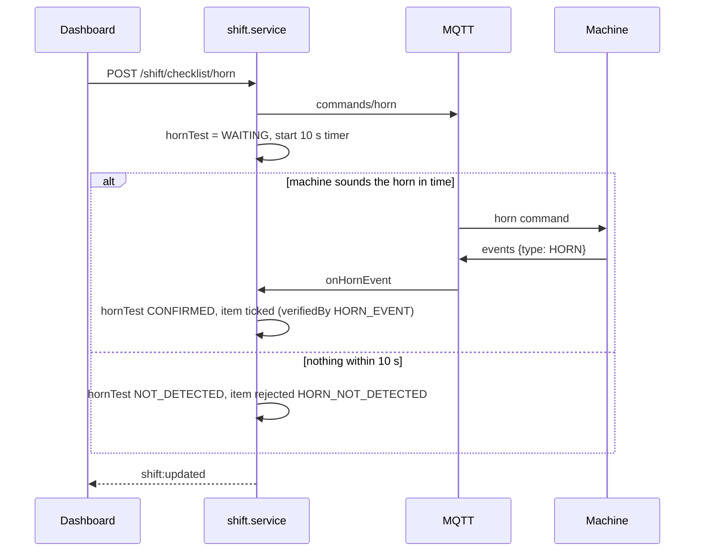

`POST /shift/checklist/complete` requires all six items and **re-checks the seatbelt** (it may have been undone
since it was ticked) before moving to `CHECKLIST_COMPLETE`.

### 7.2 Shift end and summary

`endShift` stops any active task as `INCOMPLETE`, sends `commands/shift END`, then builds the summary
(`buildSummary`) from the telemetry difference between shift start and now, the shift's alerts and today's tasks:

| Field | Calculation |
|---|---|
| `fuelUsedL` | latest `fuelConsumedLitres` − value at shift start |
| `fuelCostInr` | fuelUsedL × `FUEL_PRICE_INR` |
| `co2Kg` | fuelUsedL × 2.68 |
| `idleMinutes` | latest `idleTime` − value at shift start |
| `alerts` | count by severity for this machine since the shift began |
| `safetyScore` | `max(0, 100 − 15·critical − 8·high − 3·medium)` |
| `cleanShift` | no CRITICAL alerts and no SOS |
| `xpEarned` | 10 per completed task + 50 if `cleanShift` and at least one task done |

The XP is added to the operator (`operator.service.addXp`), which emits `xp:awarded`.

---

## 8. Tasks and live ETA

[task.service.js](backend/src/services/task.service.js). Tasks come from templates in
[data/tasks.json](backend/src/data/tasks.json) (keyed by operator).

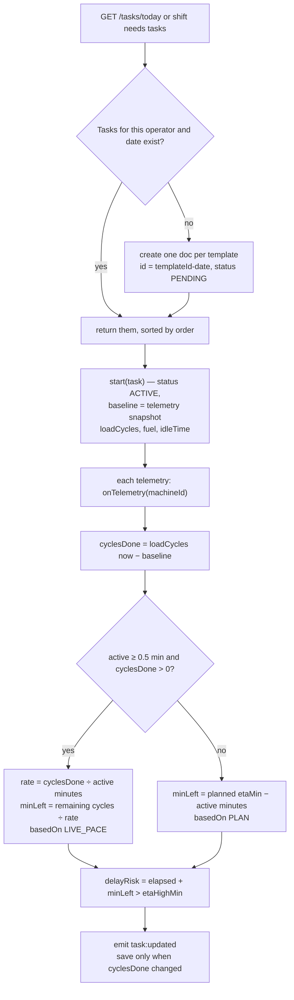

- **Time accounting**: `activeMs` accumulates only while `ACTIVE`; pause adds the running segment; resume sets a new
  `lastResumedAt`.
- **Simulator restart**: if `loadCycles` drops below the baseline, the baseline is reset so progress does not go negative.
- **Finish** (`COMPLETED` or `INCOMPLETE`): stores a `result` — cycles, actual vs predicted minutes, fuel used, idle
  minutes, alert count since the task started.
- **Ownership**: starting another operator's task returns 403. Task transitions are exposed under `/tasks/:id/...`
  but go through the shift so the shift state machine stays the single authority.

`minLeft` above is the plan/live-pace estimate. Alongside it, the **model ETA** comes from the Python model:

### 8.1 Model ETA (Python, `ml/eta/predict.py`)

[eta.service.js](backend/src/services/eta.service.js) is one more listener on the bus `telemetry` event. It does not
compute anything itself: it runs `python predict.py '<telemetry JSON>'` with the telemetry message exactly as received,
and passes the script's JSON (`eta_minutes`, and `explanation` when the script provides it) through unchanged.

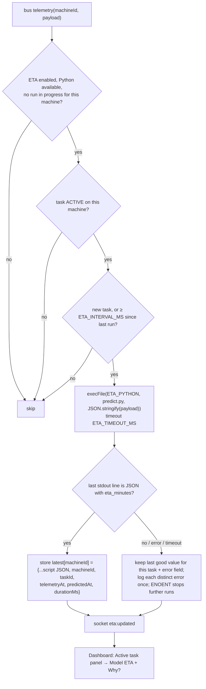

- **Why throttled:** each run starts Python and loads the model (≈3–5 s), so only machines with an ACTIVE task are
  predicted, one process per machine at a time, at most every 15 s. A new task is predicted on its next telemetry.
- **Where it is exposed:** `eta` field on `GET /api/machines/:id` and `GET /api/fleet` (so a page refresh has it),
  `GET /api/machines/:id/eta` (value + service status), socket `eta:updated`, and `eta` in `GET /api/health`.
- **Errors never reach the pipeline:** the listener is wrapped in `try`, the prediction is async, and failures are
  stored as `error` on the machine's ETA.
- **Frontend:** [EtaPanel.jsx](frontend/src/components/dashboard/EtaPanel.jsx) inside the active-task panel shows the
  value, "Updated … ago" and a **Why?** list (↑ adds time / ↓ saves time, minutes, factor). Factor names are translated
  when known and shown as sent otherwise. No values are computed or hard-coded in the UI.
- **Config:** `ETA_ENABLED`, `ETA_PYTHON`, `ETA_INTERVAL_MS` (15000), `ETA_TIMEOUT_MS` (30000).

---

## 9. Safety engine

[safety.engine.js](backend/src/services/safety.engine.js) is **deterministic and stateless except for "sustained"
timers**. It never reads `telemetry.scenario`, so detection works only from sensor values. `evaluate(machineId,
telemetry, {site, shift})` returns the list of conditions currently true plus the dynamic safety envelope.

### 9.1 Dynamic safety envelope

The stop distance grows with working conditions. `critical = 3 m × product of factors`, `warning = 2 × critical`.

| Condition | Factor |
|---|---|
| Rain | × 1.5 |
| Fog or low visibility | × 1.5 |
| Night (19:00–06:00, server clock) | × 1.3 |
| Carrying a load (`loadWeightKg > 0`) | × 1.2 |
| Moving fast (`speedKph > 5`) | × 1.3 |

Example: rain + night → 3 × 1.5 × 1.3 = 5.9 m stop zone, 11.7 m warning zone. The current envelope is emitted as
`safety:envelope` on every telemetry message and returned by `GET /site/conditions`.

### 9.2 Rules

| Rule | Fires when | Severity | Notes |
|---|---|---|---|
| `SEATBELT_VIOLATION` | seatbelt open while state is OPERATING / LOADING / UNLOADING / TRANSPORTING for **5 s** | CRITICAL | sustained timer |
| `UNATTENDED_MACHINE` | operator not present and engine rpm > 0 for **30 s** | HIGH | sustained timer |
| `LOCKOUT_NOT_ENGAGED` | operator not present and hydraulic lockout off | HIGH | immediate |
| `PROXIMITY_CRITICAL` | nearest object < critical distance | CRITICAL | uses the envelope |
| `PROXIMITY_WARNING` | nearest object < warning distance | MEDIUM | |
| `ROLLOVER_RISK` | tilt > 15°, or > 10° when loaded with the boom above 2 m | CRITICAL | |
| `OVERLOAD` | load > rated capacity | HIGH | |
| `OVERHEATING` | engine > 105 °C or hydraulic > 95 °C | HIGH | |
| `LOW_OIL_PRESSURE` | oil < 150 kPa while rpm > 800 | HIGH | |
| `HIGH_VIBRATION` | vibration > 0.8 g | MEDIUM | |
| `IMPACT` | impact > 2.5 g | CRITICAL | |
| `FATIGUE` | more than 4 h since `shift.activeSince` | MEDIUM | timer resets on pause |

`sustained()` keeps a first-seen time per machine and rule, and clears it the moment the condition stops, so
short blips do not alert.

---

## 10. Alert lifecycle

[alert.service.js](backend/src/services/alert.service.js) turns rule results into stored, de-duplicated alerts and
runs the escalation clock. It subscribes to `telemetry` on the bus.

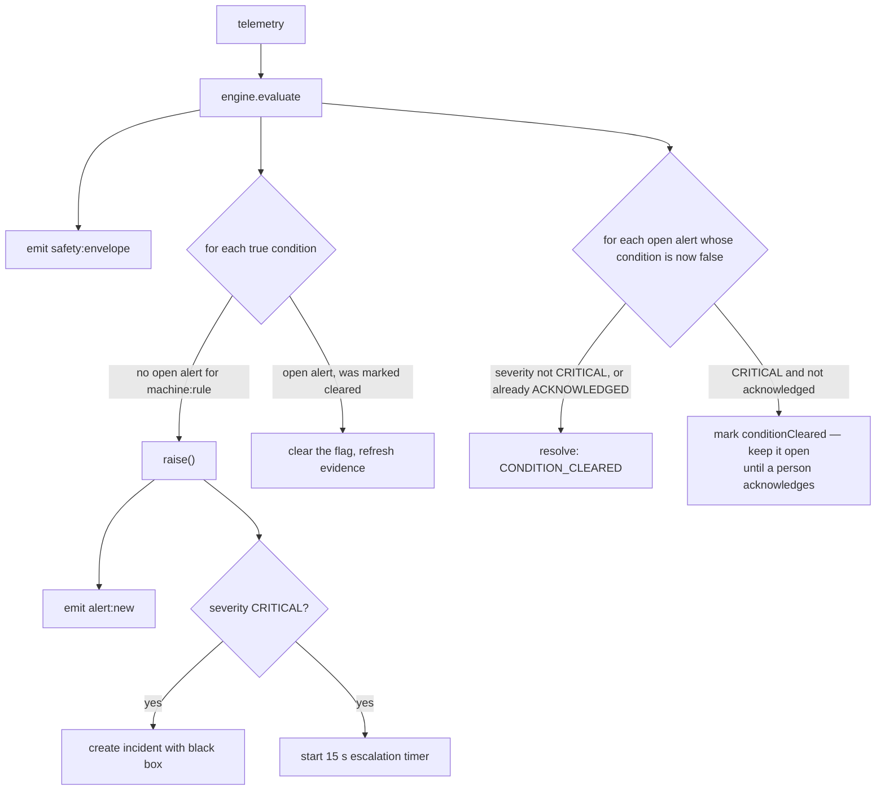

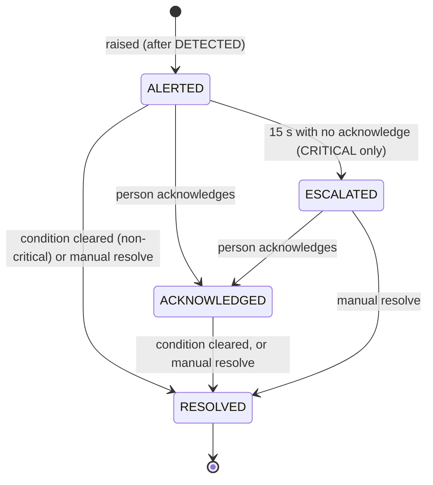

- **De-duplication**: key `machineId:ruleId`. While one alert is open, the same rule does not raise another.
  After a restart the index is rebuilt from stored open alerts.
- **Attribution**: each alert is tagged with the operator/shift of the machine's latest non-ended shift.
- **Escalation**: after `ALERT_ESCALATION_MS` (15 s) an unacknowledged CRITICAL alert becomes `ESCALATED` and
  `supervisor:escalation` is emitted (the Control Room page reacts).
- **Acknowledge** stops the escalation timer. If the condition already cleared, acknowledging also closes the alert.
- **Localised text**: an alert carries `code` and `params` (plus an English `reason`); the frontend translates
  by code, so each operator sees and hears it in their own language.
- Every step writes an audit entry (`ALERT_RAISED`, `ALERT_ESCALATED`, `ALERT_ACKNOWLEDGED`, `ALERT_RESOLVED`).

---

## 11. Incidents, SOS and the black box

[incident.service.js](backend/src/services/incident.service.js). Three kinds share one collection:

| Type | id prefix | Created by | Severity |
|---|---|---|---|
| `SAFETY_ALERT` | `INC-` | any CRITICAL alert | CRITICAL |
| `SOS` | `SOS-` | `POST /incidents/sos` (operator holds the button 2 s) | CRITICAL |
| `MAINTENANCE` | `MNT-` | failed pre-check | HIGH |

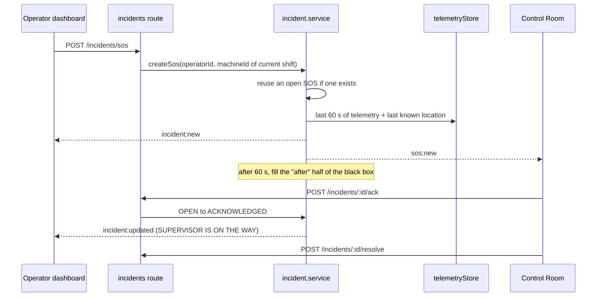

- **Black box**: `before` = telemetry from the 60 s before creation (from the in-memory history); `after` = the 60 s
  following, filled in by a timer and marked `complete`. `GET /incidents` strips the bulky black box and returns
  `hasBlackBox`; `GET /incidents/:id` returns it in full for the replay screen.
- **Lifecycle**: `OPEN → ACKNOWLEDGED → RESOLVED`, or `CANCELLED` (operator: "I'm OK"). Invalid transitions return 409.
- **Location**: taken from the machine's latest telemetry.

---

## 12. Training, XP and recommendations

[training.service.js](backend/src/services/training.service.js), modules in
[data/trainingModules.json](backend/src/data/trainingModules.json) (4 simulator scenarios, each a graph of
`ACTION` / `DECISION` / `END` nodes that the frontend's 3D simulator plays).

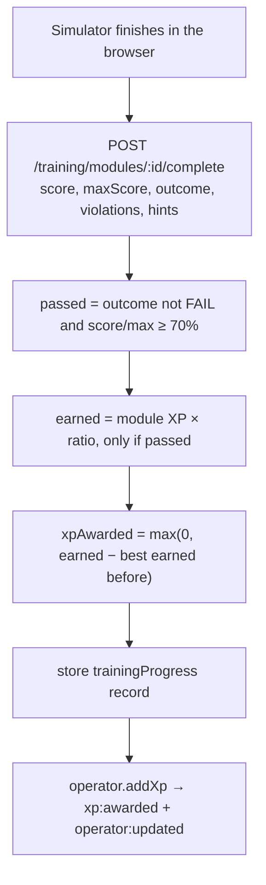

- **No XP farming**: only improving on your previous best pays out.
- **Recommendations** (`GET /training/recommended`): alerts from the last 7 days are mapped to modules
  (`SEATBELT_VIOLATION → SIM_STARTUP`, `LOCKOUT_NOT_ENGAGED` / `UNATTENDED_MACHINE → SIM_SHUTDOWN`,
  `PROXIMITY_* → SIM_PROXIMITY_RAIN`, `OVERHEATING` / `LOW_OIL_PRESSURE → SIM_OVERHEAT`). Modules already passed in the
  last 7 days are skipped; the rest are sorted by alert count with a reason code + params so the UI can translate.
  Modules never passed follow as `NOT_COMPLETED`.
- **Badges** (`/operators/me/profile`): first simulation, all simulations, clean shift, seatbelt streak (a shift in
  the last 7 days and no seatbelt alerts), zero-incident week.
- **Idle lesson** ([idleLesson.service.js](backend/src/services/idleLesson.service.js)): if the machine is
  `IDLE` with the parking brake on **and** hydraulics locked for more than `IDLE_LESSON_AFTER_SEC` (180 s), it emits
  `training:idle_prompt` once with the top recommendation. The moment the machine is no longer parked it emits
  `training:idle_prompt_cancel`, so a lesson is never offered while moving.

---

## 13. Gemini assistant

[assistant.service.js](backend/src/services/assistant.service.js), route `POST /api/assistant/chat`
`{message, history, language}` (message max 1000 characters, history filtered and trimmed) →
`{reply, actions, toolCalls, mode, model}`.

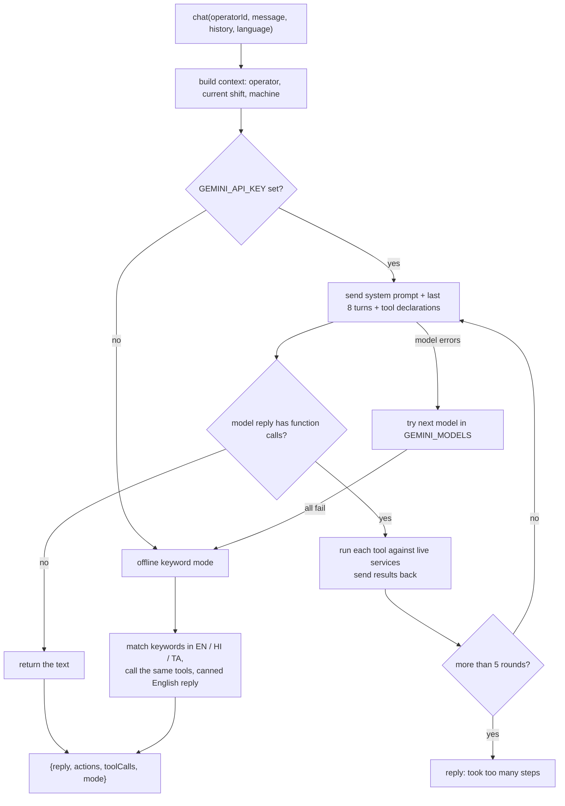

- **Tools** (all read live data — the model is told never to guess): `getMachineStatus`, `getActiveAlerts`,
  `getTodayTasks`, `getShiftState`, `getPrecheckResult`, `getIdleStats`, `getIncidents`, `getTrainingModules`,
  `getTrainingRecommendations`, `getShiftSummary`, `getOperatorProfile`, `getSiteConditions`, and `navigate`.
- **Redirecting the user**: `navigate` does not touch data; it pushes an action `{type:'navigate', target, route,
  focus, moduleId}` into the response. The frontend opens the route and scrolls to the section (`?focus=`). Valid
  targets are the 12 keys of `NAV_TARGETS`.
- **Language**: the system prompt asks for a reply in the operator's language (English, Hindi or Tamil), 1–3 sentences,
  no markdown.
- **Model fallback**: models are tried in the order of `GEMINI_MODELS`; a failing model is dropped for the rest of that
  request. The model's function-call turn is echoed back unchanged (it carries the thought signatures Gemini requires).
- **Offline mode**: regex intents for the same topics (SOS, pre-check, checklist, alerts, tasks, fuel/idle, training,
  history, profile, weather, machine status) run the same tools and return **English** text; navigation still works.
- **Safety**: the prompt forbids advising the operator to ignore a safety alert and points to SOS in emergencies.
  The assistant is read-only (except navigation); it cannot change shift or alert state.

---

## 14. Smaller features

| Feature | What it does | Where |
|---|---|---|
| Language preference | `PATCH /operators/me {language}` (en / hi / ta) stored on the operator and pushed as `operator:updated` | [operator.service.js](backend/src/services/operator.service.js) |
| XP and levels | 200 XP per level; `xp:awarded` toast | same |
| Audit log | Append-only record of every business action: shift transitions, pre-check overrides, checklist mismatches, alerts, incidents, SOS, task steps, training, maintenance tickets. `GET /audit?limit=` | [audit.service.js](backend/src/services/audit.service.js) |
| Profile | Operator, badges, training progress, last 10 shift safety scores, alerts by rule for the week | [operator.routes.js](backend/src/routes/operator.routes.js) |
| Safety behaviour | Live seatbelt compliance, this shift's alerts and safety score (`GET /shift/behaviour`, socket `behaviour:updated`); the shift summary uses the same numbers. See [../MANUAL_SAFETY_CONTROLS.md](../MANUAL_SAFETY_CONTROLS.md) | [behaviour.service.js](backend/src/services/behaviour.service.js) |
| Health | MQTT connected?, storage state, assistant `GEMINI` or `OFFLINE` | [health.routes.js](backend/src/routes/health.routes.js) |
| Detection scorecard | `npm run evaluate -- --seconds N` listens to MQTT, replays the safety engine and prints precision/recall per scenario against the simulator's labels (the **only** place that reads `scenario`) | [scripts/evaluateDetection.js](backend/src/scripts/evaluateDetection.js) |
| Dev broker | `npm run broker` starts an in-process MQTT broker (aedes) on 1883 | [scripts/mqttBroker.js](backend/src/scripts/mqttBroker.js) |

---

## 15. REST API

All under `/api`. Operator-scoped endpoints take `operatorId` (query or body).

| Router | Endpoints |
|---|---|
| health | `GET /health` |
| machines | `GET /machines`, `GET /machines/:id` (registry + telemetry + connectivity) |
| fleet | `GET /fleet` |
| operators | `GET /operators`, `GET /operators/me`, `PATCH /operators/me`, `GET /operators/me/profile` |
| shift | `GET /shift/current`; `POST /shift/precheck`, `/precheck/cancel`, `/precheck/ack-warnings`, `/switch-machine`, `/checklist/item`, `/checklist/horn`, `/checklist/complete`, `/task/start`, `/task/pause`, `/task/resume`, `/task/complete`, `/end`, `/new` |
| tasks | `GET /tasks/today`, `GET /tasks/history`; `POST /tasks/:id/start`, `/pause`, `/resume`, `/complete` |
| alerts | `GET /alerts` (`status=open`, `machineId`, `since`, `limit`), `GET /alerts/:id`, `POST /alerts/:id/ack`, `/resolve` |
| incidents | `GET /incidents`, `GET /incidents/:id`, `POST /incidents/sos`, `/:id/ack`, `/:id/resolve`, `/:id/cancel` |
| training | `GET /training/modules`, `/modules/:id`, `/progress`, `/recommended`; `POST /training/modules/:id/complete` |
| assistant | `POST /assistant/chat` |
| site | `GET /site/conditions` (with envelope) |
| audit | `GET /audit` |

## 16. Socket events

`machine:telemetry`, `machine:connectivity`, `eta:updated`, `behaviour:updated`, `site:conditions`, `shift:updated`, `precheck:progress`,
`precheck:result`, `task:updated`, `alert:new`, `alert:updated`, `safety:envelope`, `supervisor:escalation`,
`incident:new`, `incident:updated`, `sos:new`, `operator:updated`, `xp:awarded`, `training:idle_prompt`,
`training:idle_prompt_cancel`.

---

## 17. ML code in the backend folder (not connected)

Two ML pieces live in [backend/src/ml/](backend/src/ml/). The ETA model is connected; the anomaly ensemble is not
([anomalyDetection.service.js](backend/src/services/anomalyDetection.service.js) is an empty file).

| Piece | What it is | Status |
|---|---|---|
| [anomaly_ensemble.py](backend/src/ml/anomaly_ensemble.py) | Stacked anomaly ensemble (Isolation Forest, LOF, autoencoder, XGBoost, LightGBM, Random Forest + logistic meta-learner) with a `StreamDetector` for live use | No trained model file; `xgboost`/`lightgbm` not installed on this machine |
| [ml/eta/](backend/src/ml/eta/) | Task ETA regressor: `generate_dataset.js` (50 000 synthetic rows from a replay of the simulator's state machine) → `train_model.py` (HistGradientBoosting) → `model/eta_model.joblib`; `predict.py` takes telemetry JSON as a command-line argument and prints JSON; `analyze_dataset.js` profiles the CSVs | **Connected** — run by `eta.service.js` for active tasks ([§8.1](#81-model-eta-python-mlpredictpy)) |

A plan to connect the anomaly model is in [../ML_AI_PLAN.md](../ML_AI_PLAN.md).

---

## 18. Things worth knowing

Found while reading the code; none of these is a crash, but each can surprise you.

1. **No authentication anywhere.** Any client can call any endpoint with any `operatorId`, and every socket
   client receives every event. Firestore is in test mode.
2. **`heartbeat` and `machineState` bus events have no listener.** Heartbeats only refresh connectivity. The
   comment at the top of `connectivity.service.js` ("no dedicated heartbeat topic yet") is out of date.
3. **Black-box "after" half is lost on restart.** It is filled by a `setTimeout`; if the backend restarts within 60 s of
   an incident, `blackBox.complete` stays `false`.
4. **Telemetry history is memory-only** (150 readings), so black boxes and live ETA start empty after a restart.
5. **Shared machines.** EXC002 and EXC003 each have two operators. Alerts are attributed to the machine's most recently
   created non-ended shift, which may belong to an operator who has not started work (a `NOT_STARTED` shift counts).
6. **Time-dependent rules use the server clock** (`NIGHT` factor, "today" for tasks), not the site's time zone.
7. **Tasks are created once per day** from templates. If a template is edited, existing tasks for today keep the old values.
8. **`auditLog` is not preloaded** from Firestore at boot and is capped at 500 in memory.
9. **Pre-check sensor list is duplicated** in the backend and the simulator (`sensors.js`); they must be kept in sync by hand.
10. **The safety score is alert-count based only** (see §7.2); seatbelt compliance %, proximity events and idling do not
    feed into it yet.
